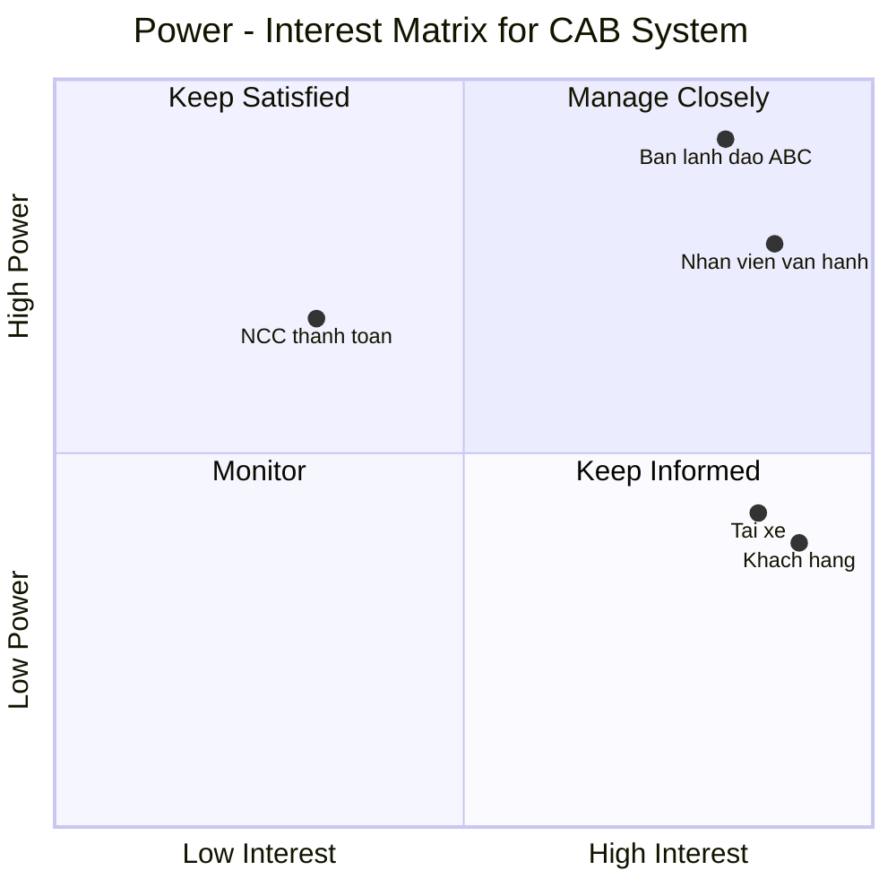
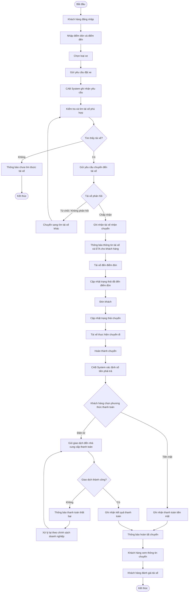
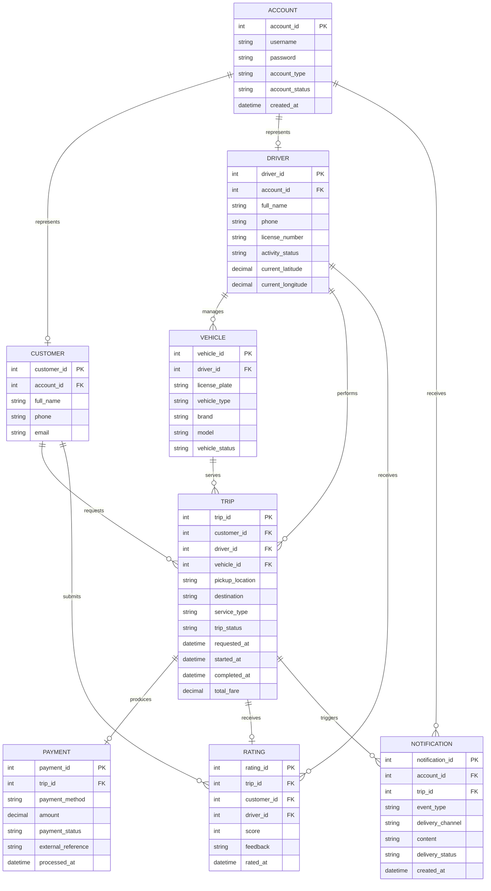
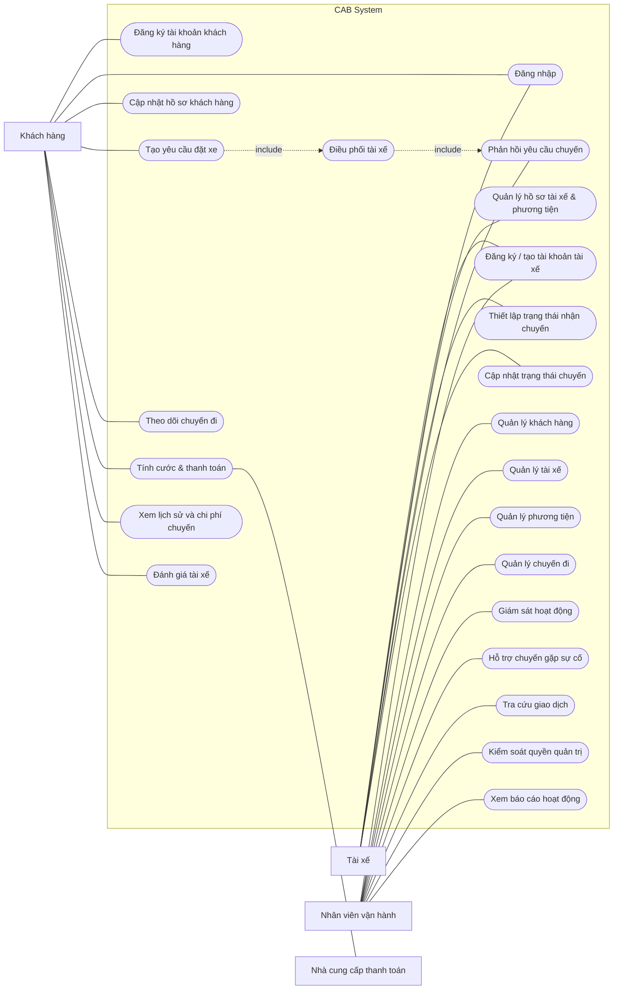

# SOFTWARE REQUIREMENTS SPECIFICATION
## Dự án: CAB System — Nền tảng đặt xe (Công ty ABC)

---

# 1. STAKEHOLDERS

Các bên liên quan của CAB System được xác định dựa trên mức độ tham gia, sử dụng và ảnh hưởng đến hoạt động của nền tảng.

| Stakeholder | Mối quan tâm và vai trò đối với CAB System |
|---|---|
| **Ban lãnh đạo Công ty ABC** | Đưa ra định hướng cho nền tảng CAB mới, mong muốn hệ thống có khả năng phục vụ quy mô lớn và hỗ trợ theo dõi các chỉ số về chuyến đi, doanh thu, tỷ lệ hoàn thành, tỷ lệ hủy và hiệu quả tài xế. |
| **Khách hàng** | Trực tiếp sử dụng dịch vụ đặt xe: quản lý tài khoản, tạo yêu cầu chuyến đi, theo dõi quá trình thực hiện, thanh toán, xem lịch sử và đánh giá tài xế. |
| **Tài xế** | Tham gia thực hiện chuyến đi; quản lý hồ sơ và phương tiện, thiết lập trạng thái sẵn sàng, tiếp nhận hoặc từ chối yêu cầu và cập nhật vị trí/trạng thái chuyến. |
| **Nhân viên vận hành** | Theo dõi và điều hành hoạt động của hệ thống; quản lý khách hàng, tài xế, phương tiện và chuyến đi, hỗ trợ các chuyến gặp sự cố và tra cứu thông tin giao dịch. |
| **Nhà cung cấp thanh toán bên ngoài** | Kết nối với CAB System để xử lý các giao dịch thanh toán điện tử và trả kết quả giao dịch cho hệ thống. |

---

# 2. STAKEHOLDER MATRIX

Stakeholder Matrix phân loại các bên liên quan theo hai yếu tố **Power** (mức độ ảnh hưởng) và **Interest** (mức độ quan tâm/chịu tác động), từ đó xác định cách thức quản lý phù hợp trong quá trình phát triển CAB System.

| Stakeholder | Power | Interest | Chiến lược quản lý |
|---|---|---|---|
| **Ban lãnh đạo Công ty ABC** | High | High | **Manage Closely** – Thường xuyên xác nhận mục tiêu, phạm vi và nhu cầu báo cáo của hệ thống. |
| **Nhân viên vận hành** | High | High | **Manage Closely** – Phối hợp chặt chẽ để làm rõ quy trình vận hành, quản trị và xử lý các trường hợp bất thường. |
| **Khách hàng** | Low | High | **Keep Informed** – Thu thập và xác nhận các nhu cầu liên quan đến đặt xe, theo dõi chuyến, thanh toán và trải nghiệm sau chuyến. |
| **Tài xế** | Low | High | **Keep Informed** – Làm rõ quy trình nhận chuyến, trạng thái hoạt động, cập nhật chuyến và vị trí. |
| **Nhà cung cấp thanh toán bên ngoài** | High | Low | **Keep Satisfied** – Đảm bảo các yêu cầu tích hợp thanh toán và bảo vệ thông tin thanh toán được đáp ứng. |

> **Ghi chú:** Customer Requirement chưa xác định một stakeholder hiện tại phù hợp rõ ràng với nhóm **Monitor**, vì vậy không bổ sung thêm stakeholder chỉ để hoàn thành đủ bốn vùng của ma trận.

---

# 3. BUSINESS GOALS

Từ các vấn đề hiện tại và kỳ vọng của Công ty ABC, các mục tiêu nghiệp vụ chính của CAB System được xác định như sau:

| ID | Mục tiêu nghiệp vụ | Kết quả mong muốn |
|---|---|---|
| **BR-01** | Phát triển nền tảng đặt xe có khả năng mở rộng | CAB System có thể phục vụ số lượng lớn khách hàng và tài xế, đồng thời tạo nền tảng cho việc bổ sung các chức năng và dịch vụ trong tương lai. |
| **BR-02** | Tự động hóa hoạt động điều phối tài xế | Giảm việc phân công thủ công bằng cách tự động tìm và ưu tiên tài xế phù hợp; tiếp tục tìm tài xế khác khi tài xế trước không phản hồi hoặc từ chối. |
| **BR-03** | Cải thiện trải nghiệm đặt và theo dõi chuyến | Khách hàng có thể thực hiện quá trình đặt xe thuận tiện, biết trạng thái tìm tài xế, thông tin tài xế nhận chuyến, ETA và trạng thái hiện tại của chuyến. |
| **BR-04** | Tăng hiệu quả quản lý hoạt động vận hành | Nhân viên vận hành có thể quản lý tập trung khách hàng, tài xế, phương tiện và chuyến đi, đồng thời theo dõi và hỗ trợ xử lý các trường hợp gặp sự cố. |
| **BR-05** | Hoàn thiện quy trình cước phí và thanh toán | Hỗ trợ xác định số tiền sau chuyến, thanh toán tiền mặt hoặc điện tử và tích hợp thanh toán bên ngoài mà không lưu trực tiếp dữ liệu thanh toán nhạy cảm. |
| **BR-06** | Đảm bảo tính ổn định và an toàn của nền tảng | Hệ thống duy trì hoạt động khi nhu cầu tăng cao, hạn chế lỗi của thanh toán/thông báo ảnh hưởng toàn hệ thống, đồng thời bảo vệ dữ liệu và kiểm soát truy cập. |
| **BR-07** | Hỗ trợ quản lý dựa trên dữ liệu hoạt động | Ban lãnh đạo có thể theo dõi các thông tin về số lượng chuyến, doanh thu, tỷ lệ hoàn thành, tỷ lệ hủy và hiệu quả hoạt động của tài xế. |
| **BR-08** | Tạo khả năng phát triển hệ thống lâu dài | Kiến trúc có thể thích ứng với loại dịch vụ, phương thức thanh toán, kênh thông báo hoặc thành phần kỹ thuật mới mà không phải xây dựng lại toàn bộ ứng dụng. |
# 4. MVP MODULES

Các module MVP được xác định nhằm đáp ứng những chức năng thiết yếu trong vòng đời của một chuyến xe, từ khi khách hàng tạo yêu cầu cho đến khi chuyến đi hoàn tất và được ghi nhận trong hệ thống.

| STT | Module | Mục tiêu của module | Phạm vi chức năng |
|---|---|---|---|
| 1 | **Tài khoản & truy cập hệ thống** | Cung cấp khả năng sử dụng và quản lý tài khoản cho các nhóm người dùng chính. | Đăng ký, đăng nhập, xác thực và cập nhật thông tin cá nhân. |
| 2 | **Tài xế & phương tiện** | Quản lý các thông tin cần thiết để tài xế tham gia hoạt động trên CAB System. | Tạo/đăng ký tài khoản tài xế, cập nhật hồ sơ, thông tin phương tiện và thiết lập trạng thái sẵn sàng nhận chuyến. |
| 3 | **Tiếp nhận yêu cầu đặt xe** | Ghi nhận nhu cầu di chuyển do khách hàng tạo trên hệ thống. | Nhập điểm đón, điểm đến, lựa chọn loại xe và gửi yêu cầu đặt xe. |
| 4 | **Điều phối tài xế** | Kết nối yêu cầu đặt xe với tài xế phù hợp mà không phụ thuộc chủ yếu vào phân công thủ công. | Xác định tài xế theo vị trí, trạng thái sẵn sàng và tiêu chí vận hành; ưu tiên tài xế phù hợp/gần khách hàng; chuyển sang tài xế khác khi cần. |
| 5 | **Theo dõi vòng đời chuyến đi** | Quản lý quá trình thực hiện chuyến sau khi yêu cầu được tiếp nhận. | Ghi nhận tài xế nhận chuyến, ETA, vị trí tài xế; cập nhật và hiển thị trạng thái chuyến từ lúc tài xế đến điểm đón đến khi hoàn thành. |
| 6 | **Cước phí & giao dịch thanh toán** | Hoàn tất nghĩa vụ thanh toán của khách hàng sau chuyến đi. | Xác định số tiền phải trả, hỗ trợ tiền mặt và thanh toán điện tử, ghi nhận kết quả giao dịch và phản hồi khi thanh toán thất bại. |
| 7 | **Thông báo & cập nhật sự kiện** | Đảm bảo khách hàng và tài xế nhận được thông tin cần thiết trong quá trình sử dụng dịch vụ. | Thông báo khi tiếp nhận yêu cầu, tài xế nhận chuyến, tài xế đến điểm đón, chuyến hoàn thành, kết quả thanh toán và các thay đổi liên quan đến chuyến. |
| 8 | **Lịch sử chuyến & phản hồi** | Cung cấp thông tin sau chuyến và ghi nhận phản hồi của khách hàng. | Xem lịch sử các chuyến đã thực hiện, số tiền phải trả và đánh giá tài xế sau khi chuyến hoàn thành. |
| 9 | **Giám sát & vận hành** | Hỗ trợ nhân viên vận hành quản lý hoạt động hằng ngày của nền tảng. | Quản lý khách hàng, tài xế, phương tiện và chuyến đi; giám sát chuyến đang diễn ra, kiểm tra trạng thái tài xế, hỗ trợ chuyến lỗi, tra cứu giao dịch và kiểm soát quyền quản trị. |
| 10 | **Báo cáo hoạt động** | Tổng hợp dữ liệu phục vụ việc theo dõi tình hình vận hành và kinh doanh. | Báo cáo số lượng chuyến, doanh thu, tỷ lệ hoàn thành, tỷ lệ hủy và hiệu quả hoạt động của tài xế. |

---

# 5. BUSINESS REQUIREMENTS

Các Business Requirements dưới đây cụ thể hóa các mục tiêu nghiệp vụ đã xác định ở mục 3 thành những yêu cầu mà CAB System cần đáp ứng.

| ID | Business Requirement | Nội dung yêu cầu |
|---|---|---|
| **BRQ-01** | Hỗ trợ quy trình đặt xe trên một nền tảng thống nhất | CAB System cần hỗ trợ chuỗi hoạt động từ tạo yêu cầu đặt xe, tìm tài xế, thực hiện chuyến, tính cước, thanh toán, thông báo cho đến đánh giá sau chuyến. |
| **BRQ-02** | Đáp ứng sự gia tăng người sử dụng | Hệ thống cần có khả năng phục vụ số lượng lớn khách hàng và tài xế, đồng thời thích ứng khi nhu cầu sử dụng tăng cao. |
| **BRQ-03** | Tự động lựa chọn tài xế phù hợp | Hệ thống cần tìm và ưu tiên tài xế dựa trên vị trí, trạng thái sẵn sàng và các tiêu chí vận hành phù hợp. |
| **BRQ-04** | Duy trì quá trình tìm tài xế khi không được chấp nhận | Khi tài xế được đề xuất không phản hồi hoặc từ chối chuyến, CAB System cần tiếp tục tìm tài xế khác mà khách hàng không phải tạo lại yêu cầu. |
| **BRQ-05** | Cung cấp khả năng theo dõi vòng đời chuyến | Khách hàng cần biết trạng thái tìm tài xế, tài xế đã nhận chuyến, thời gian dự kiến đến và trạng thái hiện tại trong quá trình thực hiện chuyến. |
| **BRQ-06** | Quản lý cước phí và các phương thức thanh toán | Sau khi chuyến hoàn thành, hệ thống cần xác định số tiền phải trả và hỗ trợ cả thanh toán tiền mặt lẫn thanh toán điện tử. |
| **BRQ-07** | Tích hợp thanh toán điện tử an toàn | Giao dịch điện tử cần được xử lý thông qua nhà cung cấp thanh toán bên ngoài và CAB System không lưu trực tiếp dữ liệu nhạy cảm của thẻ hoặc tài khoản thanh toán. |
| **BRQ-08** | Cập nhật thông tin cho các bên trong chuyến đi | Hệ thống cần thông báo cho khách hàng và tài xế tại những sự kiện quan trọng liên quan đến yêu cầu đặt xe, quá trình thực hiện chuyến và kết quả thanh toán. |
| **BRQ-09** | Hỗ trợ hoạt động quản trị và điều hành tập trung | Nhân viên vận hành cần có khả năng quản lý khách hàng, tài xế, phương tiện và chuyến đi; theo dõi hoạt động, hỗ trợ chuyến lỗi và tra cứu lịch sử giao dịch. |
| **BRQ-10** | Cung cấp thông tin phục vụ quản lý | Hệ thống cần cung cấp báo cáo về số lượng chuyến, doanh thu, tỷ lệ hoàn thành, tỷ lệ hủy và hiệu quả hoạt động của tài xế. |
| **BRQ-11** | Duy trì tính ổn định và an toàn của hệ thống | Hệ thống cần duy trì hoạt động khi nhu cầu tăng, hạn chế lỗi thanh toán/thông báo ảnh hưởng toàn bộ dịch vụ, xác thực người dùng, kiểm soát quyền quản trị, bảo vệ dữ liệu và lưu vết các thao tác quan trọng. |
| **BRQ-12** | Hỗ trợ mở rộng và thay đổi trong tương lai | Kiến trúc hệ thống cần cho phép mở rộng các thành phần độc lập, triển khai chức năng từng phần và bổ sung loại dịch vụ, phương thức thanh toán hoặc giải pháp thông báo mới mà không phải xây dựng lại toàn bộ nền tảng. |

## 5.1. Liên kết Business Goals và Business Requirements

| Business Goal | Business Requirements liên quan |
|---|---|
| **BR-01** – Phát triển nền tảng đặt xe có khả năng mở rộng | BRQ-01, BRQ-02, BRQ-12 |
| **BR-02** – Tự động hóa hoạt động điều phối tài xế | BRQ-03, BRQ-04 |
| **BR-03** – Cải thiện trải nghiệm đặt và theo dõi chuyến | BRQ-01, BRQ-05, BRQ-08 |
| **BR-04** – Tăng hiệu quả quản lý hoạt động vận hành | BRQ-09 |
| **BR-05** – Hoàn thiện quy trình cước phí và thanh toán | BRQ-06, BRQ-07 |
| **BR-06** – Đảm bảo tính ổn định và an toàn của nền tảng | BRQ-02, BRQ-07, BRQ-11 |
| **BR-07** – Hỗ trợ quản lý dựa trên dữ liệu hoạt động | BRQ-10 |
| **BR-08** – Tạo khả năng phát triển hệ thống lâu dài | BRQ-12 |

---
# 6. BUSINESS PROCESS MODELING

## 6.1. Tổng quan quy trình nghiệp vụ

Quy trình nghiệp vụ chính của CAB System mô tả toàn bộ hành trình của một yêu cầu đặt xe, bắt đầu từ khi khách hàng tạo yêu cầu cho đến khi chuyến đi được hoàn tất.

**Đặt xe → Tìm tài xế phù hợp → Tài xế phản hồi → Thực hiện chuyến → Hoàn thành chuyến → Xác định cước phí → Thanh toán → Đánh giá tài xế**

Đây là quy trình nghiệp vụ trung tâm vì có sự tham gia trực tiếp của khách hàng, tài xế, CAB System và nhà cung cấp thanh toán. Các chức năng quản lý tài khoản, vận hành và báo cáo đóng vai trò hỗ trợ cho hoạt động của quy trình này.

## 6.2. Sơ đồ quy trình nghiệp vụ

## 6.3. Thành phần tham gia quy trình

| Thành phần | Trách nhiệm trong quy trình |
|---|---|
| **Khách hàng** | Khởi tạo yêu cầu đặt xe, cung cấp thông tin chuyến, theo dõi quá trình thực hiện, lựa chọn phương thức thanh toán và đánh giá tài xế sau chuyến. |
| **Tài xế** | Tiếp nhận yêu cầu chuyến, chấp nhận hoặc từ chối, di chuyển đến điểm đón và cập nhật trạng thái trong quá trình thực hiện chuyến. |
| **CAB System** | Tiếp nhận yêu cầu, tìm và điều phối tài xế, ghi nhận trạng thái và vị trí, cung cấp thông tin chuyến, xác định cước phí, ghi nhận thanh toán và phát sinh các thông báo cần thiết. |
| **Nhà cung cấp thanh toán bên ngoài** | Tiếp nhận và xử lý giao dịch thanh toán điện tử, sau đó trả kết quả giao dịch về CAB System. |
| **Nhân viên vận hành** | Giám sát các chuyến đang diễn ra, kiểm tra trạng thái liên quan và hỗ trợ xử lý khi chuyến gặp sự cố; không tham gia thường xuyên vào luồng chuyến tiêu chuẩn. |

## 6.4. Liên kết Business Process với Business Requirements

| Business Requirement | Hoạt động nghiệp vụ liên quan |
|---|---|
| **BRQ-01 – Hỗ trợ quy trình đặt xe trên một nền tảng thống nhất** | Bao phủ toàn bộ quy trình từ tạo yêu cầu đặt xe đến hoàn tất chuyến và đánh giá. |
| **BRQ-03 – Tự động lựa chọn tài xế phù hợp** | Tiếp nhận yêu cầu → Xác định tài xế phù hợp → Gửi yêu cầu đến tài xế. |
| **BRQ-04 – Duy trì quá trình tìm tài xế khi không được chấp nhận** | Tài xế từ chối/không phản hồi → Tìm tài xế phù hợp khác. |
| **BRQ-05 – Cung cấp khả năng theo dõi vòng đời chuyến** | Ghi nhận tài xế nhận chuyến → Hiển thị ETA → Cập nhật và theo dõi trạng thái chuyến. |
| **BRQ-06 – Quản lý cước phí và các phương thức thanh toán** | Hoàn thành chuyến → Xác định cước phí → Lựa chọn và thực hiện thanh toán. |
| **BRQ-07 – Tích hợp thanh toán điện tử an toàn** | Gửi giao dịch đến nhà cung cấp thanh toán → Nhận và ghi nhận kết quả giao dịch. |
| **BRQ-08 – Cập nhật thông tin cho các bên trong chuyến đi** | Phát sinh thông báo tại các mốc quan trọng trong quá trình đặt xe, thực hiện chuyến và thanh toán. |
| **BRQ-09 – Hỗ trợ hoạt động quản trị và điều hành tập trung** | Nhân viên vận hành giám sát và hỗ trợ xử lý các chuyến gặp sự cố. |
| **BRQ-11 – Duy trì tính ổn định và an toàn của hệ thống** | Xác thực người dùng trước khi sử dụng chức năng tài khoản và duy trì hoạt động của quy trình khi các thành phần hỗ trợ gặp lỗi. |

---
# 7. FUNCTIONAL REQUIREMENTS

Các Functional Requirements mô tả những chức năng cụ thể mà CAB System cần cung cấp cho khách hàng, tài xế, nhân viên vận hành và các hoạt động xử lý bên trong hệ thống.

| ID | Nhóm chức năng | Functional Requirement | Mô tả |
|---|---|---|---|
| **FR-01** | Tài khoản & truy cập | Tạo tài khoản khách hàng | Hệ thống cho phép khách hàng đăng ký tài khoản để sử dụng các chức năng yêu cầu tài khoản. |
| **FR-02** | Tài khoản & truy cập | Tạo tài khoản tài xế | Hệ thống hỗ trợ tài xế tự đăng ký hoặc cho phép nhân viên vận hành tạo tài khoản tài xế. |
| **FR-03** | Tài khoản & truy cập | Xác thực người dùng | Hệ thống cho phép khách hàng và tài xế đăng nhập và xác thực trước khi truy cập các chức năng yêu cầu tài khoản. |
| **FR-04** | Tài khoản & truy cập | Chỉnh sửa hồ sơ khách hàng | Khách hàng có thể cập nhật thông tin cá nhân của mình trên hệ thống. |
| **FR-05** | Tài xế & phương tiện | Quản lý thông tin tài xế | Tài xế có thể cập nhật hồ sơ cá nhân, thông tin phương tiện và trạng thái hoạt động. |
| **FR-06** | Tài xế & phương tiện | Thiết lập trạng thái nhận chuyến | Tài xế có thể chuyển sang trạng thái sẵn sàng để hệ thống xem xét khi tìm tài xế cho yêu cầu mới. |
| **FR-07** | Yêu cầu đặt xe | Khai báo thông tin chuyến | Khách hàng có thể nhập điểm đón, điểm đến và lựa chọn loại xe mong muốn. |
| **FR-08** | Yêu cầu đặt xe | Gửi yêu cầu đặt xe | Khách hàng có thể gửi yêu cầu đặt xe sau khi cung cấp thông tin chuyến. |
| **FR-09** | Yêu cầu đặt xe | Ghi nhận yêu cầu | Hệ thống tiếp nhận yêu cầu đặt xe và cho khách hàng biết hệ thống đang tìm tài xế. |
| **FR-10** | Điều phối tài xế | Xác định tài xế phù hợp | Hệ thống tìm tài xế dựa trên vị trí, trạng thái sẵn sàng và các tiêu chí vận hành. |
| **FR-11** | Điều phối tài xế | Ưu tiên tài xế | Hệ thống ưu tiên các tài xế phù hợp và ở gần khách hàng. |
| **FR-12** | Điều phối tài xế | Gửi thông tin chuyến đến tài xế | Hệ thống gửi yêu cầu chuyến đến tài xế phù hợp để tài xế xem xét. |
| **FR-13** | Điều phối tài xế | Ghi nhận phản hồi của tài xế | Tài xế có thể chấp nhận hoặc từ chối yêu cầu chuyến và hệ thống ghi nhận phản hồi đó. |
| **FR-14** | Điều phối tài xế | Tiếp tục tìm tài xế | Nếu tài xế không phản hồi hoặc từ chối, hệ thống tiếp tục tìm tài xế khác mà khách hàng không phải tạo lại yêu cầu. |
| **FR-15** | Điều phối tài xế | Xử lý trường hợp không tìm được tài xế | Nếu không tìm được tài xế phù hợp, hệ thống thông báo rõ ràng kết quả cho khách hàng. |
| **FR-16** | Vòng đời chuyến | Cập nhật trạng thái chuyến | Tài xế có thể cập nhật các trạng thái: đã đến điểm đón, đã đón khách, đang di chuyển và hoàn thành chuyến. |
| **FR-17** | Vòng đời chuyến | Ghi nhận vị trí tài xế | Hệ thống lưu vị trí tài xế để hỗ trợ việc tìm tài xế gần khách hàng và dự kiến thời gian đến. |
| **FR-18** | Vòng đời chuyến | Theo dõi trạng thái chuyến | Khách hàng có thể theo dõi trạng thái hiện tại trong quá trình chuyến được thực hiện. |
| **FR-19** | Vòng đời chuyến | Cung cấp thông tin tài xế và ETA | Sau khi có tài xế nhận chuyến, hệ thống cho khách hàng biết tài xế đã nhận và thời gian dự kiến tài xế đến. |
| **FR-20** | Cước phí & thanh toán | Xác định số tiền chuyến đi | Sau khi chuyến hoàn thành, hệ thống xác định số tiền khách hàng phải trả dựa trên loại dịch vụ và thông tin chuyến. |
| **FR-21** | Cước phí & thanh toán | Hỗ trợ thanh toán tiền mặt | Hệ thống cho phép ghi nhận hình thức thanh toán bằng tiền mặt. |
| **FR-22** | Cước phí & thanh toán | Xử lý thanh toán điện tử | Hệ thống kết nối với nhà cung cấp thanh toán bên ngoài để thực hiện thanh toán điện tử. |
| **FR-23** | Cước phí & thanh toán | Ghi nhận kết quả giao dịch | Hệ thống tiếp nhận và ghi nhận kết quả của giao dịch thanh toán. |
| **FR-24** | Cước phí & thanh toán | Phản hồi khi thanh toán thất bại | Nếu thanh toán điện tử thất bại, hệ thống thông báo cho khách hàng và cho phép thử lại theo chính sách doanh nghiệp. |
| **FR-25** | Thông báo | Thông báo sự kiện cho khách hàng | Hệ thống thông báo khi yêu cầu được tiếp nhận, tài xế nhận chuyến, tài xế đến điểm đón, chuyến hoàn thành và khi có kết quả thanh toán. |
| **FR-26** | Thông báo | Thông báo sự kiện cho tài xế | Hệ thống thông báo cho tài xế về yêu cầu chuyến mới và các thay đổi liên quan đến chuyến. |
| **FR-27** | Lịch sử & phản hồi | Tra cứu lịch sử chuyến | Khách hàng có thể xem lại các chuyến đã thực hiện. |
| **FR-28** | Lịch sử & phản hồi | Xem chi phí chuyến | Khách hàng có thể xem số tiền phải trả của chuyến đi. |
| **FR-29** | Lịch sử & phản hồi | Đánh giá tài xế | Khách hàng có thể thực hiện đánh giá tài xế sau khi chuyến hoàn thành. |
| **FR-30** | Giám sát & vận hành | Quản lý khách hàng | Nhân viên vận hành có thể xem và quản lý thông tin khách hàng. |
| **FR-31** | Giám sát & vận hành | Quản lý tài xế | Nhân viên vận hành có thể xem và quản lý thông tin tài xế. |
| **FR-32** | Giám sát & vận hành | Quản lý phương tiện | Nhân viên vận hành có thể xem và quản lý thông tin phương tiện. |
| **FR-33** | Giám sát & vận hành | Quản lý chuyến đi | Nhân viên vận hành có thể xem và quản lý thông tin chuyến đi. |
| **FR-34** | Giám sát & vận hành | Giám sát hoạt động hiện tại | Nhân viên vận hành có thể xem các chuyến đang diễn ra và trạng thái hoạt động của tài xế. |
| **FR-35** | Giám sát & vận hành | Hỗ trợ chuyến gặp sự cố | Nhân viên vận hành có thể hỗ trợ xử lý các trường hợp chuyến bị lỗi hoặc phát sinh vấn đề. |
| **FR-36** | Giám sát & vận hành | Tra cứu giao dịch | Nhân viên vận hành có thể tra cứu lịch sử giao dịch liên quan đến hoạt động của hệ thống. |
| **FR-37** | Giám sát & vận hành | Kiểm soát chức năng quản trị | Hệ thống giới hạn các thao tác quản trị nhạy cảm cho những nhân viên có quyền phù hợp. |
| **FR-38** | Báo cáo hoạt động | Tổng hợp báo cáo quản lý | Hệ thống cung cấp báo cáo về số lượng chuyến, doanh thu, tỷ lệ hoàn thành, tỷ lệ hủy và hiệu quả hoạt động của tài xế. |

---

# 8. NON-FUNCTIONAL REQUIREMENTS

Các Non-Functional Requirements xác định những yêu cầu về chất lượng, bảo mật, khả năng vận hành và khả năng phát triển lâu dài của CAB System.

| ID | Thuộc tính chất lượng | Yêu cầu | Mô tả |
|---|---|---|---|
| **NFR-01** | Performance | Khả năng đáp ứng khi nhu cầu tăng | Hệ thống cần duy trì hoạt động ổn định trong các thời điểm có nhu cầu sử dụng cao. |
| **NFR-02** | Scalability | Khả năng mở rộng độc lập | Các thành phần của CAB System cần có khả năng mở rộng độc lập theo nhu cầu thay vì phải mở rộng toàn bộ hệ thống cùng lúc. |
| **NFR-03** | Availability | Cô lập lỗi thành phần | Sự cố tại chức năng thanh toán hoặc thông báo không được làm dừng toàn bộ hoạt động đặt xe. |
| **NFR-04** | Reliability | Duy trì quy trình nghiệp vụ chính | Các chức năng cốt lõi của quá trình đặt và thực hiện chuyến cần hoạt động ổn định trong điều kiện vận hành bình thường. |
| **NFR-05** | Security | Xác thực tài khoản | Khách hàng và tài xế phải được xác thực đối với các chức năng yêu cầu tài khoản. |
| **NFR-06** | Authorization | Kiểm soát quyền quản trị | Hệ thống phải kiểm soát quyền truy cập để ngăn nhân viên không có quyền thực hiện các thao tác quản trị nhạy cảm. |
| **NFR-07** | Data Protection | Bảo vệ dữ liệu nghiệp vụ | Dữ liệu cá nhân, phương tiện, vị trí và giao dịch phải được bảo vệ trong hệ thống. |
| **NFR-08** | Payment Security | Hạn chế lưu dữ liệu thanh toán nhạy cảm | CAB System không được lưu trực tiếp thông tin nhạy cảm của thẻ hoặc tài khoản thanh toán. |
| **NFR-09** | Auditability | Khả năng truy vết | Hệ thống phải ghi nhận các thao tác quan trọng để hỗ trợ việc kiểm tra và truy vết khi cần. |
| **NFR-10** | Deployability | Triển khai thay đổi có giới hạn ảnh hưởng | Chức năng mới cần có khả năng được triển khai từng phần, hạn chế tác động đến các phần khác của hệ thống. |
| **NFR-11** | Extensibility | Khả năng bổ sung chức năng mới | Kiến trúc phải hỗ trợ việc bổ sung loại dịch vụ, phương thức thanh toán và giải pháp/kênh thông báo mới trong tương lai. |
| **NFR-12** | Modularity | Khả năng thay thế thành phần | Việc thay đổi một thành phần kỹ thuật cần hạn chế yêu cầu thay đổi hoặc xây dựng lại toàn bộ ứng dụng. |

> **Lưu ý:** Customer Requirement chưa cung cấp các chỉ số định lượng như thời gian phản hồi, số lượng request/giây, tỷ lệ availability hoặc thời gian khôi phục. Vì vậy các giá trị này cần được xác nhận trước khi chuyển NFR thành tiêu chí đo lường cụ thể.

---

# 9. BUSINESS RULES

Business Rules thể hiện những ràng buộc nghiệp vụ có thể xác định từ Customer Requirement. Những chính sách chưa được khách hàng chốt sẽ không được tự giả định thành quy tắc cố định.

| ID | Business Rule | Phạm vi áp dụng | Requirement liên quan |
|---|---|---|---|
| **RL-01** | Tài xế được xem xét cho một yêu cầu chuyến phải phù hợp với vị trí, trạng thái sẵn sàng và các tiêu chí vận hành được áp dụng. | Điều phối tài xế | FR-10, FR-11 |
| **RL-02** | Khi tài xế được đề xuất không phản hồi hoặc từ chối, hệ thống phải tiếp tục tìm tài xế phù hợp khác mà khách hàng không cần tạo lại yêu cầu. | Điều phối tài xế | FR-13, FR-14 |
| **RL-03** | Nếu không tìm được tài xế phù hợp, khách hàng phải được thông báo rõ ràng về kết quả. | Điều phối tài xế | FR-15 |
| **RL-04** | Khách hàng và tài xế phải được xác thực trước khi truy cập các chức năng yêu cầu tài khoản. | Tài khoản & truy cập | FR-03, NFR-05 |
| **RL-05** | Sau khi chuyến hoàn thành, số tiền phải trả được xác định dựa trên loại dịch vụ và thông tin của chuyến đi. | Cước phí & thanh toán | FR-20 |
| **RL-06** | Thanh toán điện tử phải được xử lý thông qua nhà cung cấp thanh toán bên ngoài; CAB System không lưu trực tiếp thông tin nhạy cảm của thẻ hoặc tài khoản thanh toán. | Cước phí & thanh toán | FR-22, NFR-08 |
| **RL-07** | Khi thanh toán điện tử thất bại, khách hàng phải được thông báo và được phép thử lại theo chính sách doanh nghiệp hiện hành. | Cước phí & thanh toán | FR-24 |
| **RL-08** | Khách hàng chỉ thực hiện đánh giá tài xế sau khi chuyến đi đã hoàn thành. | Lịch sử & phản hồi | FR-29 |
| **RL-09** | Các thao tác quản trị nhạy cảm chỉ được thực hiện bởi nhân viên vận hành có quyền phù hợp. | Giám sát & vận hành | FR-37, NFR-06 |
| **RL-10** | Sự cố của chức năng thanh toán hoặc thông báo không được làm dừng toàn bộ hệ thống đặt xe. | Vận hành hệ thống | NFR-03 |
| **RL-11** | Các thao tác quan trọng của hệ thống phải được lưu vết để phục vụ kiểm tra và truy vết khi cần. | Toàn hệ thống | NFR-09 |

## 9.1. Các quy tắc chưa được xác định

Các nội dung sau **chưa được khách hàng chốt thành Business Rule cụ thể** và cần được BA xác nhận trước khi phát triển:

- Công thức và quy tắc tính cước chi tiết.
- Thứ tự và tiêu chí ưu tiên tài xế cụ thể.
- Thời gian tối đa để tài xế phản hồi yêu cầu chuyến.
- Chính sách hủy chuyến và các điều kiện liên quan.
- Cách xử lý khi khách hàng hoặc tài xế mất kết nối mạng.
- Thời gian lưu trữ các loại dữ liệu.
- Chính sách cụ thể về số lần hoặc điều kiện thử lại khi thanh toán thất bại.

---
# 10. EXCEPTION CASES & OPEN QUESTIONS

## 10.1. Exception Cases

Các trường hợp ngoại lệ dưới đây mô tả những tình huống có thể làm luồng nghiệp vụ chính không diễn ra theo cách thông thường và cách CAB System cần phản hồi dựa trên các yêu cầu hiện có.

| ID | Khu vực nghiệp vụ | Tình huống ngoại lệ | Hướng xử lý |
|---|---|---|---|
| **EX-01** | Điều phối tài xế | Không có tài xế phù hợp | Hệ thống thông báo rõ ràng cho khách hàng rằng hiện tại không tìm được tài xế phù hợp. |
| **EX-02** | Điều phối tài xế | Tài xế không phản hồi yêu cầu chuyến | Hệ thống tiếp tục tìm tài xế phù hợp khác mà khách hàng không phải gửi lại yêu cầu đặt xe. |
| **EX-03** | Điều phối tài xế | Tài xế từ chối yêu cầu chuyến | Hệ thống tiếp tục quá trình tìm và đề xuất tài xế khác cho yêu cầu hiện tại. |
| **EX-04** | Thanh toán | Giao dịch điện tử không thành công | Hệ thống thông báo kết quả thất bại cho khách hàng và cho phép thử lại theo chính sách doanh nghiệp. |
| **EX-05** | Quản lý chuyến | Chuyến đi phát sinh lỗi hoặc vấn đề cần hỗ trợ | Nhân viên vận hành có thể kiểm tra thông tin liên quan và hỗ trợ xử lý trường hợp chuyến gặp sự cố. |
| **EX-06** | Dịch vụ hỗ trợ | Thành phần thanh toán gặp sự cố | Sự cố thanh toán không được làm toàn bộ nền tảng đặt xe ngừng hoạt động. |
| **EX-07** | Dịch vụ hỗ trợ | Thành phần thông báo gặp sự cố | Sự cố thông báo không được làm toàn bộ nền tảng đặt xe ngừng hoạt động. |
| **EX-08** | Xác thực | Khách hàng hoặc tài xế chưa được xác thực | Hệ thống từ chối quyền truy cập vào những chức năng yêu cầu tài khoản cho đến khi người dùng được xác thực. |
| **EX-09** | Quản trị | Nhân viên vận hành không có quyền thực hiện thao tác nhạy cảm | Hệ thống ngăn thao tác và chỉ cho phép nhân viên có quyền phù hợp thực hiện chức năng đó. |

## 10.2. Open Questions / TBD

Một số chính sách nghiệp vụ và thông số vận hành chưa được xác định trong Customer Requirement. Các nội dung này cần được Business Analyst làm rõ với stakeholder trước khi hoàn thiện thiết kế và triển khai.

| ID | Vấn đề cần làm rõ | Nội dung cần xác nhận với stakeholder |
|---|---|---|
| **OQ-01** | Quy tắc tính cước | Cước chuyến đi được tính cụ thể theo những yếu tố nào và công thức tính như thế nào? |
| **OQ-02** | Tiêu chí ưu tiên tài xế | Ngoài vị trí và trạng thái sẵn sàng, những tiêu chí vận hành nào được sử dụng và thứ tự ưu tiên giữa các tiêu chí ra sao? |
| **OQ-03** | Thời gian phản hồi chuyến | Tài xế có bao nhiêu thời gian để phản hồi trước khi hệ thống tiếp tục tìm tài xế khác? |
| **OQ-04** | Chính sách hủy chuyến | Khách hàng hoặc tài xế được hủy chuyến trong những trường hợp nào và việc hủy chuyến được xử lý ra sao? |
| **OQ-05** | Mất kết nối mạng | CAB System cần xử lý như thế nào nếu khách hàng hoặc tài xế mất kết nối trong quá trình đặt hoặc thực hiện chuyến? |
| **OQ-06** | Thời gian lưu trữ dữ liệu | Dữ liệu tài khoản, vị trí, chuyến đi, giao dịch và các dữ liệu liên quan cần được lưu trong thời gian bao lâu? |
| **OQ-07** | Thử lại thanh toán | Khi thanh toán điện tử thất bại, điều kiện và giới hạn cho phép khách hàng thử lại là gì? |
| **OQ-08** | Điều kiện kết thúc tìm tài xế | Sau thời gian hoặc điều kiện nào CAB System được phép kết luận rằng không tìm được tài xế phù hợp? |
| **OQ-09** | Cập nhật vị trí tài xế | Vị trí tài xế cần được cập nhật ở những thời điểm/trạng thái nào và với tần suất bao nhiêu? |
| **OQ-10** | Phân quyền nhân viên vận hành | Những vai trò quản trị cụ thể nào cần tồn tại và mỗi vai trò được phép thực hiện những thao tác nhạy cảm nào? |

---

# 11. ENTITY MODEL — CAB SYSTEM

## 11.1. Tổng quan mô hình dữ liệu

Mô hình dưới đây thể hiện các thực thể nghiệp vụ chính cần thiết để hỗ trợ phiên bản CAB System MVP.

Các thuộc tính trong mô hình được đề xuất ở mức phân tích nhằm thể hiện mối quan hệ giữa tài khoản, khách hàng, tài xế, phương tiện, chuyến đi, thanh toán, đánh giá và thông báo. Thiết kế cơ sở dữ liệu chi tiết có thể tiếp tục được điều chỉnh ở giai đoạn thiết kế hệ thống.

## 11.2. Entity Relationship Diagram

## 11.3. Mô tả các thực thể chính

| Entity | Ý nghĩa nghiệp vụ |
|---|---|
| **ACCOUNT** | Lưu thông tin cần thiết phục vụ tài khoản và xác thực của khách hàng hoặc tài xế. |
| **CUSTOMER** | Đại diện cho khách hàng sử dụng CAB System để tạo và quản lý các chuyến đi của mình. |
| **DRIVER** | Đại diện cho tài xế, bao gồm thông tin hồ sơ, trạng thái hoạt động và thông tin vị trí cần thiết cho quá trình điều phối. |
| **VEHICLE** | Đại diện cho phương tiện gắn với tài xế và được sử dụng để thực hiện chuyến đi. |
| **TRIP** | Thực thể trung tâm ghi nhận yêu cầu đặt xe và thông tin trong vòng đời của một chuyến đi. |
| **PAYMENT** | Ghi nhận phương thức, số tiền và kết quả thanh toán liên quan đến chuyến; không dùng để lưu trực tiếp dữ liệu thẻ/tài khoản thanh toán nhạy cảm. |
| **RATING** | Ghi nhận đánh giá của khách hàng đối với tài xế sau khi chuyến đi hoàn thành. |
| **NOTIFICATION** | Ghi nhận các thông báo phát sinh từ sự kiện của chuyến và được gửi đến người dùng qua kênh phù hợp. |

## 11.4. Các quan hệ nghiệp vụ chính

| Quan hệ | Ý nghĩa |
|---|---|
| **ACCOUNT – CUSTOMER / DRIVER** | Một tài khoản có thể đại diện cho hồ sơ khách hàng hoặc hồ sơ tài xế tương ứng. |
| **DRIVER – VEHICLE** | Tài xế có thông tin phương tiện phục vụ hoạt động nhận và thực hiện chuyến. |
| **CUSTOMER – TRIP** | Một khách hàng có thể tạo nhiều yêu cầu/chuyến đi. |
| **DRIVER – TRIP** | Một tài xế có thể thực hiện nhiều chuyến theo thời gian. |
| **VEHICLE – TRIP** | Phương tiện được ghi nhận với chuyến mà tài xế thực hiện. |
| **TRIP – PAYMENT** | Một chuyến có thông tin thanh toán liên quan sau khi hoàn thành. |
| **TRIP – RATING** | Chuyến hoàn thành có thể nhận đánh giá từ khách hàng. |
| **TRIP – NOTIFICATION** | Các sự kiện trong vòng đời chuyến có thể phát sinh nhiều thông báo. |

---
# 12. USE CASE DIAGRAM — CAB SYSTEM MVP

Use Case Diagram dưới đây thể hiện các tác nhân bên ngoài và những chức năng chính mà họ tương tác trực tiếp với CAB System.

## 12.1. Danh sách Actor

| Actor | Tương tác chính với CAB System |
|---|---|
| **Khách hàng** | Quản lý tài khoản, đặt xe, theo dõi chuyến, thanh toán, xem lịch sử và đánh giá tài xế. |
| **Tài xế** | Quản lý hồ sơ/phương tiện, thay đổi trạng thái sẵn sàng, phản hồi yêu cầu và cập nhật trạng thái chuyến. |
| **Nhân viên vận hành** | Quản lý dữ liệu vận hành, giám sát chuyến, hỗ trợ sự cố, tra cứu giao dịch, thực hiện chức năng quản trị theo quyền và xem báo cáo. |
| **Nhà cung cấp thanh toán** | Tương tác với CAB System trong quá trình xử lý giao dịch thanh toán điện tử. |

---
# 13. ACCEPTANCE CRITERIA

Acceptance Criteria xác định kết quả tối thiểu cần quan sát được để xác nhận từng Functional Requirement đã được đáp ứng.

| ID | Functional Requirement | Acceptance Criteria |
|---|---|---|
| **AC-01** | FR-01 – Tạo tài khoản khách hàng | Khách hàng có thể gửi thông tin đăng ký và hệ thống tạo được tài khoản khi dữ liệu cần thiết được chấp nhận. |
| **AC-02** | FR-02 – Tạo tài khoản tài xế | Tài khoản tài xế có thể được tạo thông qua tài xế đăng ký hoặc nhân viên vận hành thực hiện việc tạo tài khoản. |
| **AC-03** | FR-03 – Xác thực người dùng | Khách hàng hoặc tài xế có thể đăng nhập với thông tin xác thực hợp lệ và truy cập các chức năng yêu cầu tài khoản. |
| **AC-04** | FR-04 – Chỉnh sửa hồ sơ khách hàng | Khách hàng có thể thay đổi thông tin cá nhân và hệ thống ghi nhận thông tin sau khi cập nhật. |
| **AC-05** | FR-05 – Quản lý thông tin tài xế | Tài xế có thể cập nhật hồ sơ và thông tin phương tiện của mình. |
| **AC-06** | FR-06 – Thiết lập trạng thái nhận chuyến | Tài xế có thể chuyển sang trạng thái sẵn sàng và hệ thống ghi nhận trạng thái để phục vụ quá trình tìm tài xế. |
| **AC-07** | FR-07 – Khai báo thông tin chuyến | Khách hàng có thể cung cấp điểm đón, điểm đến và lựa chọn loại xe cho yêu cầu chuyến. |
| **AC-08** | FR-08 – Gửi yêu cầu đặt xe | Hệ thống tiếp nhận được yêu cầu đặt xe do khách hàng gửi. |
| **AC-09** | FR-09 – Ghi nhận yêu cầu | Sau khi tiếp nhận yêu cầu, hệ thống ghi nhận yêu cầu và cho khách hàng biết hệ thống đang tìm tài xế. |
| **AC-10** | FR-10 – Xác định tài xế phù hợp | Hệ thống có thể xác định tài xế dựa trên vị trí, trạng thái sẵn sàng và tiêu chí vận hành được áp dụng. |
| **AC-11** | FR-11 – Ưu tiên tài xế | Trong quá trình tìm kiếm, hệ thống ưu tiên tài xế phù hợp và gần khách hàng. |
| **AC-12** | FR-12 – Gửi thông tin chuyến đến tài xế | Tài xế phù hợp nhận được yêu cầu chuyến để đưa ra phản hồi. |
| **AC-13** | FR-13 – Ghi nhận phản hồi tài xế | Hệ thống ghi nhận được kết quả tài xế chấp nhận hoặc từ chối yêu cầu. |
| **AC-14** | FR-14 – Tiếp tục tìm tài xế | Khi tài xế không phản hồi hoặc từ chối, quá trình tìm tài xế khác được tiếp tục mà không yêu cầu khách hàng tạo lại yêu cầu. |
| **AC-15** | FR-15 – Không tìm được tài xế | Khi không tìm được tài xế phù hợp, khách hàng nhận được thông báo rõ ràng. |
| **AC-16** | FR-16 – Cập nhật trạng thái chuyến | Tài xế có thể cập nhật các trạng thái đã đến điểm đón, đã đón khách, đang di chuyển và hoàn thành chuyến. |
| **AC-17** | FR-17 – Ghi nhận vị trí tài xế | CAB System ghi nhận được vị trí tài xế để phục vụ matching và dự kiến thời gian đến. |
| **AC-18** | FR-18 – Theo dõi trạng thái chuyến | Khách hàng xem được trạng thái hiện tại của chuyến trong quá trình thực hiện. |
| **AC-19** | FR-19 – Thông tin tài xế và ETA | Khi có tài xế nhận chuyến, khách hàng xem được thông tin tài xế và thời gian dự kiến đến. |
| **AC-20** | FR-20 – Xác định số tiền chuyến | Sau khi chuyến hoàn thành, hệ thống xác định được số tiền phải trả dựa trên loại dịch vụ và thông tin chuyến. |
| **AC-21** | FR-21 – Thanh toán tiền mặt | Hệ thống hỗ trợ và ghi nhận phương thức thanh toán tiền mặt cho chuyến. |
| **AC-22** | FR-22 – Thanh toán điện tử | Khi sử dụng thanh toán điện tử, CAB System có thể gửi giao dịch đến nhà cung cấp thanh toán bên ngoài và tiếp nhận kết quả. |
| **AC-23** | FR-23 – Ghi nhận kết quả giao dịch | Kết quả thanh toán trả về được hệ thống ghi nhận cho giao dịch tương ứng. |
| **AC-24** | FR-24 – Thanh toán thất bại | Khi thanh toán điện tử thất bại, khách hàng được thông báo và có khả năng thử lại theo chính sách doanh nghiệp. |
| **AC-25** | FR-25 – Thông báo cho khách hàng | Khách hàng được thông báo tại các mốc được yêu cầu: tiếp nhận yêu cầu, tài xế nhận chuyến, tài xế đến điểm đón, hoàn thành chuyến và kết quả thanh toán. |
| **AC-26** | FR-26 – Thông báo cho tài xế | Tài xế được thông báo về yêu cầu chuyến mới hoặc thay đổi liên quan đến chuyến. |
| **AC-27** | FR-27 – Tra cứu lịch sử chuyến | Khách hàng có thể xem các chuyến đã thực hiện trong lịch sử. |
| **AC-28** | FR-28 – Xem chi phí chuyến | Khách hàng có thể xem số tiền phải trả liên quan đến chuyến. |
| **AC-29** | FR-29 – Đánh giá tài xế | Sau khi chuyến hoàn thành, khách hàng có thể gửi đánh giá cho tài xế. |
| **AC-30** | FR-30 – Quản lý khách hàng | Nhân viên vận hành có thể truy cập và quản lý thông tin khách hàng theo quyền được cấp. |
| **AC-31** | FR-31 – Quản lý tài xế | Nhân viên vận hành có thể truy cập và quản lý thông tin tài xế theo quyền được cấp. |
| **AC-32** | FR-32 – Quản lý phương tiện | Nhân viên vận hành có thể truy cập và quản lý thông tin phương tiện theo quyền được cấp. |
| **AC-33** | FR-33 – Quản lý chuyến đi | Nhân viên vận hành có thể xem và quản lý thông tin chuyến đi. |
| **AC-34** | FR-34 – Giám sát hoạt động hiện tại | Nhân viên vận hành có thể xem các chuyến đang diễn ra và trạng thái hoạt động của tài xế. |
| **AC-35** | FR-35 – Hỗ trợ chuyến gặp sự cố | Nhân viên vận hành có thể truy cập thông tin cần thiết để hỗ trợ xử lý chuyến gặp sự cố. |
| **AC-36** | FR-36 – Tra cứu giao dịch | Nhân viên vận hành có thể tra cứu lịch sử giao dịch liên quan. |
| **AC-37** | FR-37 – Kiểm soát chức năng quản trị | Nhân viên không có quyền phù hợp bị ngăn thực hiện thao tác quản trị nhạy cảm. |
| **AC-38** | FR-38 – Tổng hợp báo cáo quản lý | Hệ thống cung cấp được thông tin báo cáo về số lượng chuyến, doanh thu, tỷ lệ hoàn thành, tỷ lệ hủy và hiệu quả tài xế. |

---
# 14. REQUIREMENTS TRACEABILITY MATRIX

Requirements Traceability Matrix (RTM) thể hiện mối liên hệ từ Business Goal đến Business Requirement, Module, Functional Requirement, Use Case và Acceptance Criteria.

| Business Goal | Business Requirement | Module / Process | Functional Requirement | Use Case | Acceptance Criteria |
|---|---|---|---|---|---|
| BR-01 | BRQ-01 | Tài khoản & truy cập | FR-01 – Tạo tài khoản khách hàng | UC01 | AC-01 |
| BR-01 | BRQ-01 | Tài khoản & truy cập | FR-02 – Tạo tài khoản tài xế | UC02 | AC-02 |
| BR-01 | BRQ-01 | Tài khoản & truy cập | FR-03 – Xác thực người dùng | UC03 | AC-03 |
| BR-03 | BRQ-01 | Tài khoản & truy cập | FR-04 – Chỉnh sửa hồ sơ khách hàng | UC04 | AC-04 |
| BR-01 | BRQ-01 | Tài xế & phương tiện | FR-05 – Quản lý thông tin tài xế | UC05 | AC-05 |
| BR-02 | BRQ-03 | Tài xế & phương tiện | FR-06 – Thiết lập trạng thái nhận chuyến | UC06 | AC-06 |
| BR-03 | BRQ-01 | Yêu cầu đặt xe | FR-07 – Khai báo thông tin chuyến | UC07 | AC-07 |
| BR-03 | BRQ-01 | Yêu cầu đặt xe | FR-08 – Gửi yêu cầu đặt xe | UC07 | AC-08 |
| BR-03 | BRQ-01 | Yêu cầu đặt xe | FR-09 – Ghi nhận yêu cầu | UC07 | AC-09 |
| BR-02 | BRQ-03 | Điều phối tài xế | FR-10 – Xác định tài xế phù hợp | UC08 | AC-10 |
| BR-02 | BRQ-03 | Điều phối tài xế | FR-11 – Ưu tiên tài xế | UC08 | AC-11 |
| BR-02 | BRQ-03 | Điều phối tài xế | FR-12 – Gửi thông tin chuyến đến tài xế | UC08 | AC-12 |
| BR-02 | BRQ-03 | Điều phối tài xế | FR-13 – Ghi nhận phản hồi tài xế | UC09 | AC-13 |
| BR-02 | BRQ-04 | Điều phối tài xế | FR-14 – Tiếp tục tìm tài xế | UC08 | AC-14 |
| BR-02 | BRQ-04 | Điều phối tài xế | FR-15 – Không tìm được tài xế | UC08 | AC-15 |
| BR-03 | BRQ-05 | Theo dõi vòng đời chuyến | FR-16 – Cập nhật trạng thái chuyến | UC10 | AC-16 |
| BR-02 | BRQ-03 | Theo dõi vòng đời chuyến | FR-17 – Ghi nhận vị trí tài xế | UC10 | AC-17 |
| BR-03 | BRQ-05 | Theo dõi vòng đời chuyến | FR-18 – Theo dõi trạng thái chuyến | UC11 | AC-18 |
| BR-03 | BRQ-05 | Theo dõi vòng đời chuyến | FR-19 – Thông tin tài xế và ETA | UC11 | AC-19 |
| BR-05 | BRQ-06 | Cước phí & thanh toán | FR-20 – Xác định số tiền chuyến | UC12 | AC-20 |
| BR-05 | BRQ-06 | Cước phí & thanh toán | FR-21 – Thanh toán tiền mặt | UC12 | AC-21 |
| BR-05 | BRQ-07 | Cước phí & thanh toán | FR-22 – Thanh toán điện tử | UC12 | AC-22 |
| BR-05 | BRQ-07 | Cước phí & thanh toán | FR-23 – Ghi nhận kết quả giao dịch | UC12 | AC-23 |
| BR-05 | BRQ-06 | Cước phí & thanh toán | FR-24 – Thanh toán thất bại | UC12 | AC-24 |
| BR-03 | BRQ-08 | Thông báo & cập nhật | FR-25 – Thông báo cho khách hàng | UC07 / UC10 / UC12 | AC-25 |
| BR-03 | BRQ-08 | Thông báo & cập nhật | FR-26 – Thông báo cho tài xế | UC08 / UC10 | AC-26 |
| BR-03 | BRQ-05 | Lịch sử & phản hồi | FR-27 – Tra cứu lịch sử chuyến | UC13 | AC-27 |
| BR-03 | BRQ-05 | Lịch sử & phản hồi | FR-28 – Xem chi phí chuyến | UC13 | AC-28 |
| BR-03 | BRQ-01 | Lịch sử & phản hồi | FR-29 – Đánh giá tài xế | UC14 | AC-29 |
| BR-04 | BRQ-09 | Giám sát & vận hành | FR-30 – Quản lý khách hàng | UC15 | AC-30 |
| BR-04 | BRQ-09 | Giám sát & vận hành | FR-31 – Quản lý tài xế | UC16 | AC-31 |
| BR-04 | BRQ-09 | Giám sát & vận hành | FR-32 – Quản lý phương tiện | UC17 | AC-32 |
| BR-04 | BRQ-09 | Giám sát & vận hành | FR-33 – Quản lý chuyến đi | UC18 | AC-33 |
| BR-04 | BRQ-09 | Giám sát & vận hành | FR-34 – Giám sát hoạt động hiện tại | UC19 | AC-34 |
| BR-04 | BRQ-09 | Giám sát & vận hành | FR-35 – Hỗ trợ chuyến gặp sự cố | UC20 | AC-35 |
| BR-04 | BRQ-09 | Giám sát & vận hành | FR-36 – Tra cứu giao dịch | UC21 | AC-36 |
| BR-06 | BRQ-11 | Giám sát & vận hành | FR-37 – Kiểm soát chức năng quản trị | UC22 | AC-37 |
| BR-07 | BRQ-10 | Báo cáo hoạt động | FR-38 – Tổng hợp báo cáo quản lý | UC23 | AC-38 |

---
