# CAB System – Week 1 Business & System Analysis

# 1. Stakeholder List & Roles

## 1.1. Danh sách Stakeholder

| ID | Stakeholder | Vai trò | Mối quan tâm chính |
|---|---|---|---|
| ST-01 | Khách hàng (Customer) | Người sử dụng dịch vụ đặt xe | Đặt xe, theo dõi chuyến, thanh toán, xem lịch sử và đánh giá tài xế |
| ST-02 | Tài xế (Driver) | Người cung cấp dịch vụ vận chuyển | Nhận chuyến, quản lý trạng thái hoạt động và cập nhật trạng thái chuyến |
| ST-03 | Nhân viên vận hành (Operator) | Quản lý hoạt động CAB System | Quản lý khách hàng, tài xế, phương tiện, chuyến đi và hỗ trợ xử lý sự cố |
| ST-04 | Ban lãnh đạo (Management) | Theo dõi và quản lý hoạt động kinh doanh | Báo cáo chuyến đi, doanh thu, tỷ lệ hoàn thành/hủy và hiệu quả tài xế |
| ST-05 | Nhà cung cấp thanh toán | Hệ thống bên ngoài xử lý thanh toán điện tử | Tiếp nhận và xử lý giao dịch thanh toán điện tử |

---

# 2. Stakeholder Matrix

Stakeholder Matrix được xây dựng dựa trên hai yếu tố:

- **Power:** Mức độ ảnh hưởng đến CAB System.
- **Interest:** Mức độ quan tâm đến CAB System.

> Lưu ý: Customer Requirement không cung cấp điểm Power/Interest cụ thể. Vị trí dưới đây là phân tích của BA dựa trên vai trò của từng stakeholder.

| Stakeholder | Power | Interest | Strategy |
|---|---|---|---|
| Ban lãnh đạo | Cao | Cao | Manage Closely |
| Nhân viên vận hành | Cao | Cao | Manage Closely |
| Khách hàng | Thấp | Cao | Keep Informed |
| Tài xế | Thấp | Cao | Keep Informed |
| Nhà cung cấp thanh toán | Thấp | Trung bình | Monitor |

## Mermaid – Stakeholder Matrix

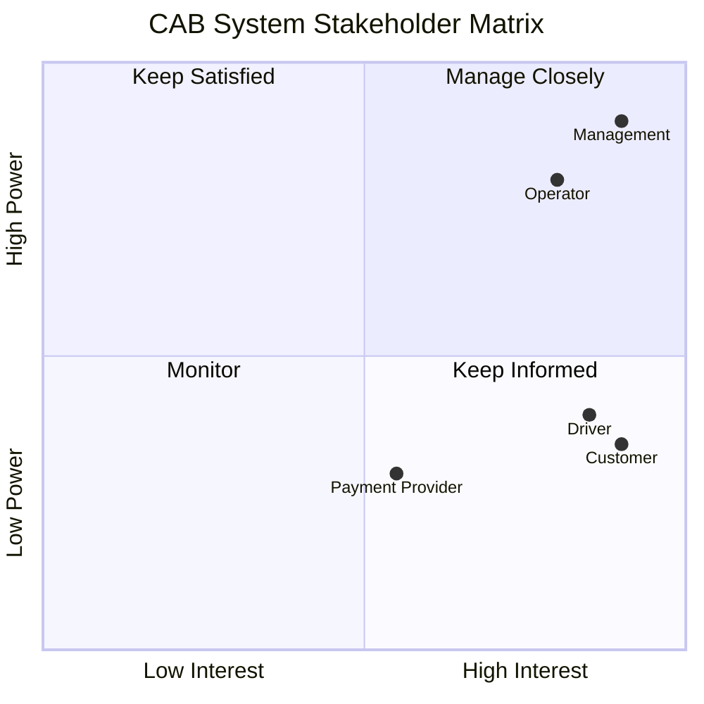

---

# 3. Business Goals

| ID | Business Goal | Mô tả |
|---|---|---|
| BG-01 | Số hóa quy trình đặt xe | Cho phép khách hàng thực hiện quy trình đặt xe trực tuyến thay vì phụ thuộc vào phân công thủ công |
| BG-02 | Cải thiện quá trình phân công tài xế | Tìm và phân công tài xế phù hợp dựa trên vị trí và trạng thái sẵn sàng |
| BG-03 | Tăng khả năng theo dõi chuyến đi | Giúp khách hàng, tài xế và nhân viên vận hành biết trạng thái chuyến |
| BG-04 | Quản lý thanh toán tập trung | Ghi nhận tiền cước và kết quả thanh toán của chuyến đi |
| BG-05 | Cải thiện khả năng vận hành | Cho phép nhân viên quản lý khách hàng, tài xế, phương tiện và chuyến đi |
| BG-06 | Hỗ trợ theo dõi hoạt động kinh doanh | Cung cấp dữ liệu về chuyến đi, doanh thu, tỷ lệ hoàn thành/hủy và hiệu quả tài xế |
| BG-07 | Xây dựng nền tảng có khả năng mở rộng | Cho phép các thành phần mở rộng và phát triển độc lập khi nhu cầu tăng |

---

# 4. Minimum Viable Product (MVP) Modules

CAB System MVP được chia thành **8 module nghiệp vụ chính**. Việc phân chia module nhằm nhóm các chức năng có cùng mục đích nghiệp vụ, giúp xác định rõ phạm vi MVP và làm cơ sở cho việc xác định Business Requirements, Functional Requirements và thiết kế hệ thống ở các giai đoạn tiếp theo.

> **Lưu ý:** Các module dưới đây là **module nghiệp vụ của MVP**, chưa đồng nghĩa mỗi module bắt buộc phải được triển khai thành một Microservice riêng.

| ID | Module | Mục tiêu | Chức năng chính |
|---|---|---|---|
| **MOD-01** | **Account** | Quản lý tài khoản và thông tin người dùng | Đăng ký tài khoản khách hàng/tài xế; cho phép nhân viên vận hành tạo tài khoản tài xế; đăng nhập và xác thực; cập nhật thông tin cá nhân |
| **MOD-02** | **Driver & Vehicle** | Quản lý thông tin cần thiết của tài xế và phương tiện để tài xế có thể tham gia nhận chuyến | Quản lý hồ sơ tài xế; thông tin phương tiện; trạng thái hoạt động; trạng thái sẵn sàng nhận chuyến; cập nhật và lưu vị trí tài xế |
| **MOD-03** | **Trip** | Quản lý vòng đời của yêu cầu đặt xe và chuyến đi | Tiếp nhận điểm đón, điểm đến và loại xe; tạo yêu cầu chuyến; lưu thông tin chuyến; theo dõi trạng thái; gán tài xế/phương tiện sau khi matching thành công; lưu lịch sử chuyến |
| **MOD-04** | **Driver Matching** | Tìm và phân công tài xế phù hợp cho yêu cầu đặt xe | Tìm tài xế dựa trên vị trí, trạng thái sẵn sàng và tiêu chí vận hành; đề xuất chuyến cho tài xế; ghi nhận phản hồi; tiếp tục tìm tài xế khác khi bị từ chối hoặc không phản hồi; xử lý trường hợp không tìm được tài xế |
| **MOD-05** | **Fare & Payment** | Xác định số tiền phải trả và quản lý quá trình thanh toán của chuyến | Xác định tiền cước sau khi chuyến hoàn thành; hỗ trợ tiền mặt và thanh toán điện tử; tích hợp nhà cung cấp thanh toán bên ngoài; ghi nhận kết quả xử lý thanh toán; hỗ trợ trường hợp thanh toán điện tử thất bại |
| **MOD-06** | **Notification** | Cung cấp thông tin kịp thời cho khách hàng và tài xế về các sự kiện quan trọng | Thông báo khi yêu cầu đặt xe được tiếp nhận, tài xế nhận chuyến, tài xế đến điểm đón, chuyến hoàn thành và có kết quả thanh toán; thông báo chuyến mới hoặc thay đổi chuyến cho tài xế; hỗ trợ khả năng mở rộng kênh thông báo |
| **MOD-07** | **Rating** | Thu thập đánh giá của khách hàng sau chuyến đi | Cho phép khách hàng đánh giá tài xế sau khi chuyến hoàn thành; ghi nhận đánh giá gắn với chuyến và tài xế tương ứng |
| **MOD-08** | **Operations & Reporting** | Hỗ trợ hoạt động vận hành và theo dõi tình hình kinh doanh của CAB System | Quản lý khách hàng, tài xế và phương tiện; theo dõi chuyến đang diễn ra và trạng thái tài xế; hỗ trợ chuyến gặp lỗi; tra cứu lịch sử giao dịch; cung cấp dữ liệu báo cáo |

---
# 5. Business Requirements – CAB System MVP

Các Business Requirements xác định những khả năng nghiệp vụ chính mà CAB System cần đáp ứng trong phạm vi MVP.

| ID | Business Requirement | Mô tả |
|---|---|---|
| **BR-01** | **Quản lý tài khoản** | Hỗ trợ khách hàng và tài xế đăng ký, đăng nhập và cập nhật thông tin cá nhân. Nhân viên vận hành có thể tạo tài khoản cho tài xế. |
| **BR-02** | **Quản lý tài xế và phương tiện** | Quản lý hồ sơ tài xế, thông tin phương tiện, trạng thái hoạt động, trạng thái sẵn sàng và vị trí tài xế. |
| **BR-03** | **Quản lý yêu cầu đặt xe và chuyến đi** | Cho phép khách hàng nhập điểm đón, điểm đến, chọn loại xe, gửi yêu cầu đặt xe, theo dõi trạng thái và xem lịch sử chuyến. |
| **BR-04** | **Tìm và phân công tài xế** | Tìm tài xế phù hợp dựa trên vị trí, trạng thái sẵn sàng và tiêu chí vận hành. Nếu tài xế từ chối hoặc không phản hồi, hệ thống tiếp tục tìm tài xế khác. |
| **BR-05** | **Thực hiện chuyến đi** | Cho phép tài xế chấp nhận hoặc từ chối chuyến và cập nhật trạng thái trong quá trình thực hiện chuyến. |
| **BR-06** | **Tính cước và thanh toán** | Xác định số tiền phải trả sau khi chuyến hoàn thành; hỗ trợ thanh toán tiền mặt, thanh toán điện tử và ghi nhận kết quả thanh toán. |
| **BR-07** | **Thông báo** | Gửi thông báo cho khách hàng và tài xế khi có các sự kiện quan trọng liên quan đến chuyến đi và thanh toán. |
| **BR-08** | **Đánh giá sau chuyến** | Cho phép khách hàng đánh giá tài xế sau khi chuyến đi hoàn thành. |
| **BR-09** | **Quản lý vận hành và báo cáo** | Hỗ trợ quản lý khách hàng, tài xế, phương tiện, chuyến đi, giao dịch và cung cấp dữ liệu báo cáo phục vụ quản lý. |

> **Lưu ý:** Các nội dung chưa được xác định cụ thể như công thức tính cước, tiêu chí ưu tiên tài xế, thời gian phản hồi, chính sách hủy chuyến, xử lý mất kết nối và thời gian lưu trữ dữ liệu được quản lý dưới trạng thái **TBD**.

# 6. Business Process Modeling

Mỗi Business Requirement tương ứng với một quy trình nghiệp vụ chính của CAB System.

---

## BP-01 – Quản lý tài khoản

**Liên kết:** BR-01

Quy trình mô tả việc đăng ký tài khoản, đăng nhập và cập nhật thông tin cá nhân của người dùng. Đối với tài xế, tài khoản có thể do tài xế đăng ký hoặc do nhân viên vận hành tạo.

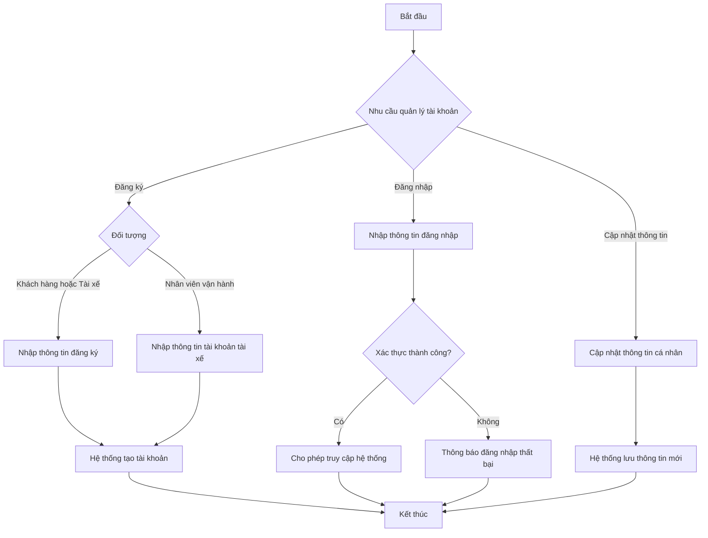

---

## BP-02 – Quản lý tài xế và phương tiện

**Liên kết:** BR-02

Quy trình mô tả việc tài xế quản lý hồ sơ, thông tin phương tiện, trạng thái hoạt động và vị trí phục vụ quá trình tìm tài xế.

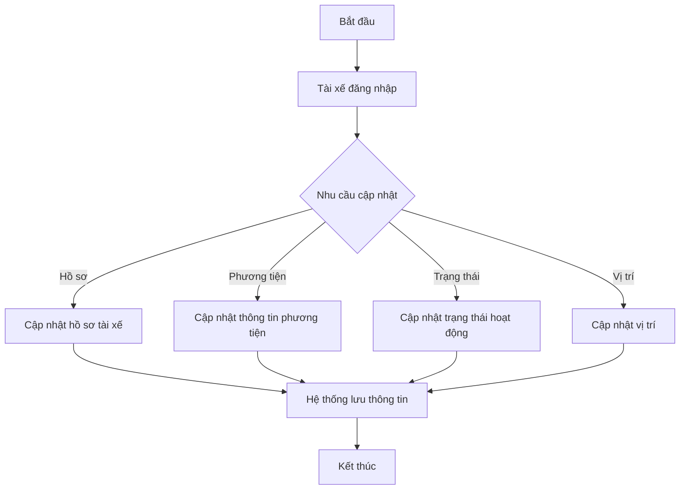

---

## BP-03 – Tạo và theo dõi yêu cầu đặt xe

**Liên kết:** BR-03

Quy trình mô tả việc khách hàng tạo yêu cầu đặt xe và theo dõi thông tin của chuyến.

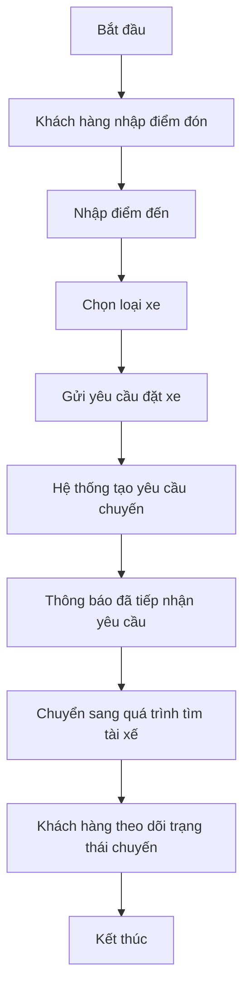

---

## BP-04 – Tìm và phân công tài xế

**Liên kết:** BR-04

Quy trình mô tả việc CAB System tìm tài xế phù hợp dựa trên vị trí, trạng thái sẵn sàng và các tiêu chí vận hành. Nếu tài xế từ chối hoặc không phản hồi, hệ thống tiếp tục tìm tài xế khác.

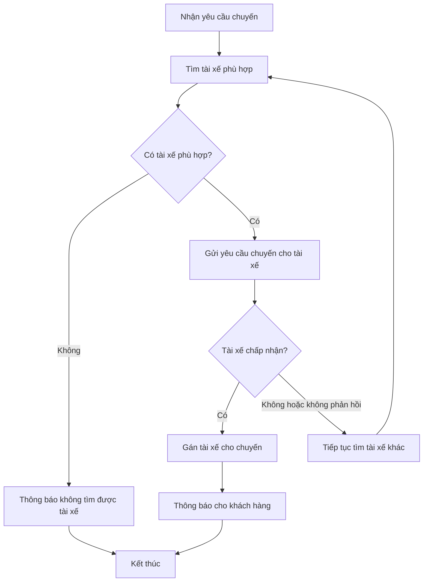

---

## BP-05 – Thực hiện chuyến đi

**Liên kết:** BR-05

Quy trình mô tả quá trình thực hiện chuyến sau khi tài xế chấp nhận yêu cầu.

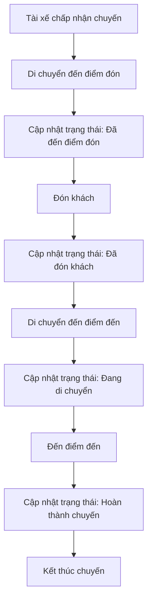

---

## BP-06 – Tính cước và thanh toán

**Liên kết:** BR-06

Quy trình mô tả việc tính số tiền phải trả sau khi chuyến hoàn thành và xử lý thanh toán bằng tiền mặt hoặc thanh toán điện tử.

> **Lưu ý:** Công thức tính cước và chính sách xử lý lại thanh toán hiện là **TBD**.

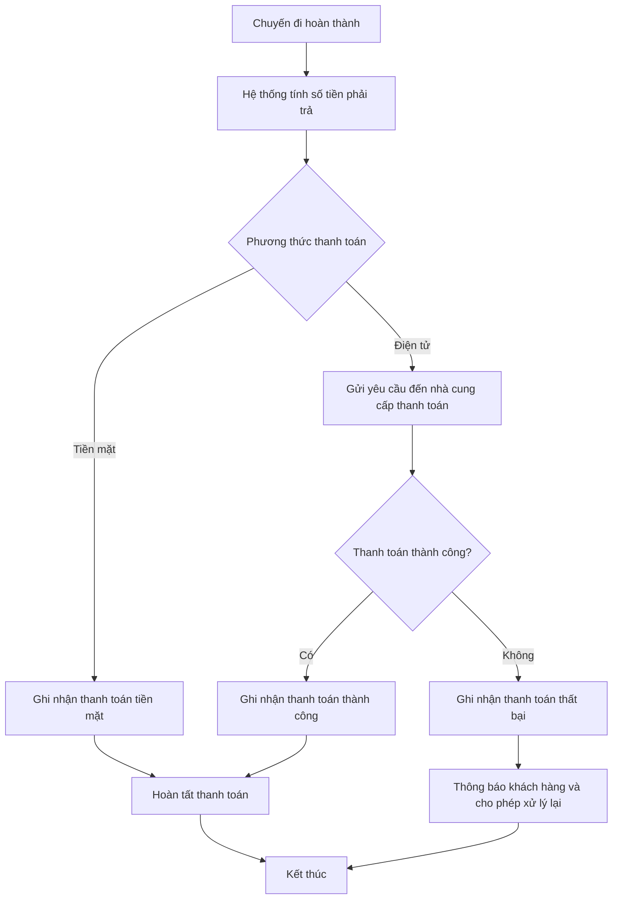

---

## BP-07 – Gửi thông báo

**Liên kết:** BR-07

Quy trình mô tả việc gửi thông báo đến khách hàng hoặc tài xế khi có sự kiện liên quan đến chuyến đi hoặc thanh toán.

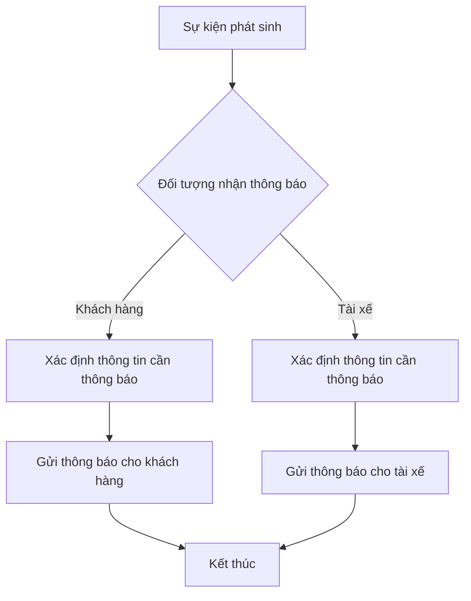

Các sự kiện thông báo chính đối với khách hàng gồm:

- Yêu cầu đặt xe được tiếp nhận.
- Có tài xế nhận chuyến.
- Tài xế đến điểm đón.
- Chuyến đi hoàn thành.
- Có kết quả thanh toán.

Đối với tài xế:

- Có yêu cầu chuyến mới.
- Có thay đổi liên quan đến chuyến đang thực hiện.

---

## BP-08 – Đánh giá tài xế

**Liên kết:** BR-08

Quy trình mô tả việc khách hàng đánh giá tài xế sau khi chuyến đi hoàn thành.

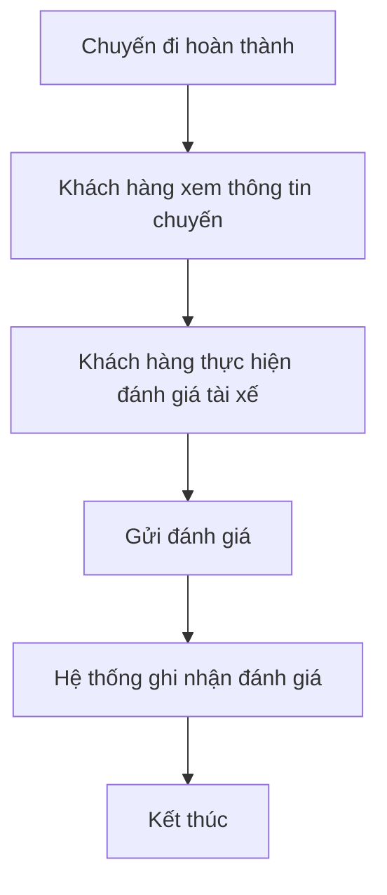

---

## BP-09 – Quản lý vận hành và báo cáo

**Liên kết:** BR-09

Quy trình mô tả việc nhân viên vận hành truy cập các chức năng quản lý, theo dõi hoạt động CAB System và khai thác dữ liệu báo cáo.

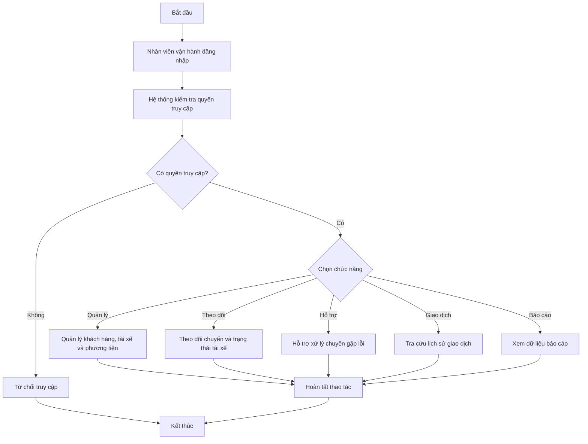

---

# 7. Functional Requirements

Các Functional Requirements mô tả những chức năng cụ thể mà CAB System phải cung cấp trong phạm vi MVP.

Tổng cộng: **20 Functional Requirements**.

| ID | Module | Functional Requirement | Mô tả |
|---|---|---|---|
| **FR-01** | Account | Đăng ký và tạo tài khoản | Cho phép khách hàng và tài xế đăng ký tài khoản; nhân viên vận hành có thể tạo tài khoản cho tài xế. |
| **FR-02** | Account | Đăng nhập | Cho phép khách hàng và tài xế đăng nhập và được xác thực trước khi sử dụng các chức năng yêu cầu tài khoản. |
| **FR-03** | Account | Cập nhật thông tin cá nhân | Cho phép khách hàng và tài xế cập nhật thông tin cá nhân. |
| **FR-04** | Driver & Vehicle | Quản lý hồ sơ và phương tiện | Cho phép tài xế cập nhật hồ sơ và thông tin phương tiện. |
| **FR-05** | Driver & Vehicle | Cập nhật trạng thái hoạt động | Cho phép tài xế cập nhật trạng thái hoạt động và trạng thái sẵn sàng nhận chuyến. |
| **FR-06** | Driver & Vehicle | Cập nhật vị trí tài xế | Lưu vị trí tài xế để hỗ trợ tìm tài xế gần khách hàng và dự kiến thời gian đến. |
| **FR-07** | Trip | Tạo yêu cầu đặt xe | Cho phép khách hàng nhập điểm đón, điểm đến, chọn loại xe và gửi yêu cầu đặt xe. |
| **FR-08** | Trip | Theo dõi chuyến | Cho phép khách hàng theo dõi trạng thái chuyến, thông tin tài xế nhận chuyến và thời gian dự kiến tài xế đến. |
| **FR-09** | Trip | Xem lịch sử chuyến | Cho phép khách hàng xem lịch sử chuyến đi và số tiền phải trả của từng chuyến. |
| **FR-10** | Driver Matching | Tìm và đề xuất tài xế | Tìm và đề xuất chuyến cho tài xế phù hợp dựa trên vị trí, trạng thái sẵn sàng và tiêu chí vận hành; ghi nhận kết quả phản hồi của tài xế. |
| **FR-11** | Driver Matching | Tiếp tục tìm tài xế | Khi tài xế từ chối hoặc không phản hồi, hệ thống tiếp tục tìm tài xế khác; nếu không tìm được tài xế phù hợp thì thông báo cho khách hàng. |
| **FR-12** | Trip | Chấp nhận hoặc từ chối chuyến | Cho phép tài xế nhận thông báo chuyến mới và chấp nhận hoặc từ chối chuyến. |
| **FR-13** | Trip | Cập nhật trạng thái chuyến | Cho phép tài xế cập nhật trạng thái: đã đến điểm đón, đã đón khách, đang di chuyển và hoàn thành chuyến. |
| **FR-14** | Fare & Payment | Tính cước | Sau khi chuyến hoàn thành, hệ thống xác định số tiền phải trả dựa trên loại dịch vụ và thông tin chuyến đi. |
| **FR-15** | Fare & Payment | Xử lý thanh toán | Hỗ trợ thanh toán tiền mặt hoặc điện tử qua nhà cung cấp bên ngoài; ghi nhận phương thức, số tiền và kết quả của các lần xử lý thanh toán. |
| **FR-16** | Fare & Payment | Xử lý thanh toán thất bại | Khi thanh toán điện tử thất bại, hệ thống thông báo cho khách hàng và cho phép xử lý lại theo chính sách doanh nghiệp. |
| **FR-17** | Notification | Gửi thông báo | Gửi thông báo cho khách hàng và tài xế khi có các sự kiện quan trọng liên quan đến yêu cầu đặt xe, chuyến đi và thanh toán. |
| **FR-18** | Rating | Đánh giá tài xế | Cho phép khách hàng đánh giá tài xế sau khi chuyến đi hoàn thành. |
| **FR-19** | Operations & Reporting | Quản lý vận hành | Cho phép nhân viên vận hành quản lý khách hàng, tài xế, phương tiện; theo dõi chuyến và trạng thái tài xế; hỗ trợ chuyến gặp lỗi và tra cứu lịch sử giao dịch theo quyền được cấp. |
| **FR-20** | Operations & Reporting | Xem báo cáo | Cung cấp dữ liệu báo cáo về số lượng chuyến, doanh thu, tỷ lệ hoàn thành, tỷ lệ hủy và hiệu quả hoạt động của tài xế. |

> **Lưu ý:** Các nội dung chưa được Customer Requirement xác định cụ thể như công thức tính cước, tiêu chí ưu tiên tài xế, thời gian phản hồi và chính sách xử lý lại thanh toán được giữ ở trạng thái **TBD**.
# 8. Business Rules

Business Rules mô tả các quy tắc và ràng buộc nghiệp vụ mà CAB System phải tuân thủ. Các quy tắc chưa được xác định đầy đủ được đánh dấu **TBD** hoặc **Need Confirmation** để tiếp tục làm rõ với các bên liên quan.

| ID | Business Rule | Trạng thái |
|---|---|---|
| BRU-01 | Khách hàng và tài xế phải được xác thực trước khi sử dụng các chức năng yêu cầu tài khoản | Confirmed |
| BRU-02 | Chỉ tài xế đang ở trạng thái sẵn sàng mới được xem xét để nhận chuyến | Confirmed |
| BRU-03 | Việc tìm tài xế phải xem xét vị trí của tài xế | Confirmed |
| BRU-04 | Khi tài xế từ chối hoặc không phản hồi, hệ thống phải tiếp tục tìm tài xế khác | Confirmed |
| BRU-05 | Khách hàng không phải tạo lại yêu cầu khi hệ thống chuyển sang tìm tài xế khác | Confirmed |
| BRU-06 | Nếu không tìm được tài xế phù hợp, khách hàng phải được thông báo | Confirmed |
| BRU-07 | Việc tính cước được thực hiện sau khi chuyến đi hoàn thành | Confirmed |
| BRU-08 | Số tiền phải trả được xác định dựa trên loại dịch vụ và thông tin chuyến đi | Confirmed |
| BRU-09 | Thông tin nhạy cảm của thẻ hoặc tài khoản thanh toán không được lưu trực tiếp trong CAB System | Confirmed |
| BRU-10 | Khách hàng chỉ được đánh giá tài xế sau khi chuyến đi hoàn thành | Confirmed |
| BRU-11 | Các thao tác quản trị nhạy cảm phải được kiểm soát quyền truy cập | Confirmed |
| BRU-12 | Công thức tính cước cụ thể | TBD |
| BRU-13 | Tiêu chí ưu tiên tài xế chi tiết | TBD |
| BRU-14 | Thời gian tài xế phải phản hồi yêu cầu chuyến | TBD |
| BRU-15 | Chính sách hủy chuyến | TBD |
| BRU-16 | Quy tắc xử lý khi mất kết nối mạng | TBD |
| BRU-17 | Thời gian lưu trữ dữ liệu | TBD |
| BRU-18 | Mỗi lần đề xuất chuyến cho tài xế cần ghi nhận kết quả phản hồi để hệ thống xác định có tiếp tục tìm tài xế khác hay không | Derived – Need Confirmation |
| BRU-19 | Một chuyến chỉ được ghi nhận tối đa một đánh giá của khách hàng cho tài xế trong phạm vi MVP | Assumption – Need Confirmation |

> **TBD (To Be Determined):** Nội dung chưa được khách hàng xác định cụ thể và cần được làm rõ với các bên liên quan trước khi phát triển.

> **Derived – Need Confirmation:** Quy tắc được suy ra từ luồng nghiệp vụ hiện tại nhưng chưa được khách hàng xác nhận trực tiếp.

> **Assumption – Need Confirmation:** Giả định được đưa ra để hoàn thiện mô hình hệ thống và cần được xác nhận trước khi triển khai.

# 9. Non-Functional Requirements

Non-Functional Requirements mô tả các yêu cầu về chất lượng, bảo mật, khả năng mở rộng và độ ổn định của CAB System.

| ID | Nhóm | Non-Functional Requirement |
|---|---|---|
| NFR-01 | Availability | Hệ thống phải hoạt động ổn định trong các thời điểm nhu cầu tăng cao |
| NFR-02 | Fault Isolation | Lỗi ở chức năng thanh toán không được làm toàn bộ hệ thống đặt xe ngừng hoạt động |
| NFR-03 | Fault Isolation | Lỗi ở chức năng thông báo không được làm toàn bộ hệ thống đặt xe ngừng hoạt động |
| NFR-04 | Scalability | Các thành phần của hệ thống phải có khả năng mở rộng độc lập khi tải tăng |
| NFR-05 | Deployability | Các chức năng mới phải có khả năng triển khai từng phần và hạn chế ảnh hưởng đến các chức năng đang hoạt động |
| NFR-06 | Authentication | Khách hàng và tài xế phải được xác thực trước khi sử dụng các chức năng yêu cầu tài khoản |
| NFR-07 | Authorization | Các chức năng quản trị phải được kiểm soát quyền truy cập |
| NFR-08 | Security | Thông tin cá nhân, phương tiện, vị trí và giao dịch phải được bảo vệ |
| NFR-09 | Payment Security | CAB System không được lưu trực tiếp thông tin nhạy cảm của thẻ hoặc tài khoản thanh toán |
| NFR-10 | Auditability | Các thao tác quan trọng phải được lưu vết để phục vụ kiểm tra khi có sự cố |
| NFR-11 | Extensibility | Hệ thống phải hỗ trợ việc bổ sung loại dịch vụ, phương thức thanh toán và nhà cung cấp thông báo trong tương lai mà không phải xây dựng lại toàn bộ ứng dụng |

> Customer Requirement chưa cung cấp các giá trị định lượng như thời gian phản hồi, số lượng request/giây hoặc tỷ lệ availability. Vì vậy các giá trị này chưa được tự giả định trong Week 1.

---
# 10. Entity Relationship Diagram (ERD)

> ERD mô tả các thực thể dữ liệu cần thiết để hỗ trợ các Business Requirements và Functional Requirements của CAB System MVP.
>
> Mô hình tập trung vào dữ liệu nghiệp vụ của MVP. Các chi tiết thuần kỹ thuật sẽ được xác định thêm ở giai đoạn thiết kế hệ thống.

## 10.1. ERD – Mermaid

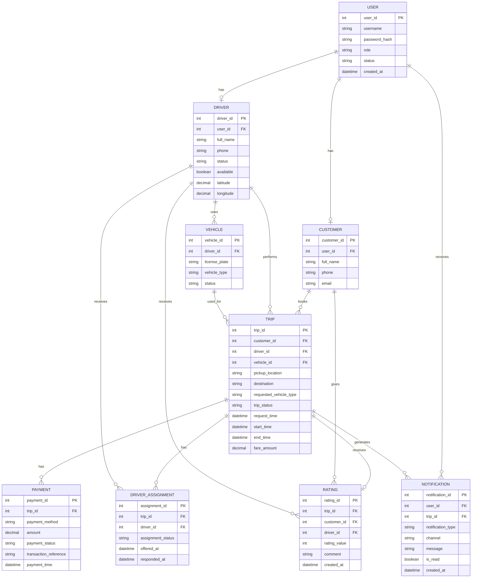

---

## 10.2. Main Entities

| Entity | Vai trò |
|---|---|
| **USER** | Lưu thông tin tài khoản chung phục vụ đăng nhập, xác thực, trạng thái tài khoản và vai trò người dùng |
| **CUSTOMER** | Lưu hồ sơ của khách hàng sử dụng dịch vụ đặt xe |
| **DRIVER** | Lưu hồ sơ tài xế, trạng thái hoạt động, trạng thái sẵn sàng và vị trí hiện tại |
| **VEHICLE** | Lưu thông tin phương tiện được tài xế sử dụng |
| **TRIP** | Lưu yêu cầu đặt xe và thông tin quá trình thực hiện chuyến đi |
| **DRIVER_ASSIGNMENT** | Ghi nhận việc đề xuất một chuyến cho tài xế và kết quả phản hồi của tài xế |
| **PAYMENT** | Ghi nhận thông tin và kết quả của các lần xử lý thanh toán cho chuyến |
| **RATING** | Lưu đánh giá của khách hàng dành cho tài xế sau chuyến |
| **NOTIFICATION** | Lưu thông báo được gửi cho khách hàng hoặc tài xế khi có sự kiện liên quan |

---

# 11. Use Case Diagram

Sau khi gom Functional Requirements, Use Case cũng được gom lại ở mức nghiệp vụ để tránh chia quá nhỏ.

## 11.1. Actors

### Primary Actors

- **Customer** – Khách hàng.
- **Driver** – Tài xế.
- **Operator** – Nhân viên vận hành.

### Supporting Actor

- **Payment Provider** – Nhà cung cấp thanh toán điện tử.

## 11.2. Use Cases

### Customer

- UC-01 – Register Account
- UC-02 – Login
- UC-03 – Update Profile
- UC-04 – Request Trip
- UC-05 – Track Trip
- UC-06 – View Trip History
- UC-07 – Make Payment
- UC-08 – Rate Driver

### Driver

- UC-01 – Register Account
- UC-02 – Login
- UC-03 – Update Profile
- UC-09 – Manage Vehicle
- UC-10 – Update Availability & Location
- UC-11 – Accept / Reject Trip
- UC-12 – Update Trip Status

### Operator

- UC-02 – Login
- UC-13 – Manage Customers
- UC-14 – Manage Drivers & Vehicles
- UC-15 – Monitor & Handle Trips
- UC-16 – View Transaction History
- UC-17 – View Reports

### Payment Provider

- UC-18 – Process Electronic Payment

## 11.3. Use Case Diagram – Mermaid

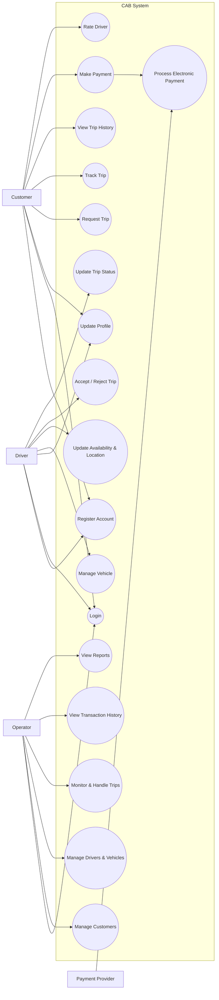

---

# 12. Acceptance Criteria

Acceptance Criteria được xác định tương ứng với **20 Functional Requirements** của CAB System MVP.

| FR | Functional Requirement | Given | When | Then |
|---|---|---|---|---|
| **FR-01** | Đăng ký và tạo tài khoản | Khách hàng hoặc tài xế cung cấp thông tin đăng ký hợp lệ | Gửi yêu cầu đăng ký | Hệ thống tạo tài khoản tương ứng |
| **FR-01** | Đăng ký và tạo tài khoản | Nhân viên vận hành thực hiện chức năng tạo tài khoản tài xế | Cung cấp thông tin cần thiết | Hệ thống tạo tài khoản tài xế |
| **FR-02** | Đăng nhập | Người dùng có tài khoản hợp lệ | Cung cấp thông tin đăng nhập chính xác | Hệ thống xác thực và cho phép truy cập các chức năng phù hợp |
| **FR-02** | Đăng nhập | Thông tin đăng nhập không hợp lệ | Người dùng đăng nhập | Hệ thống từ chối đăng nhập |
| **FR-03** | Cập nhật thông tin cá nhân | Người dùng đã đăng nhập | Cập nhật thông tin cá nhân hợp lệ | Hệ thống lưu thông tin mới |
| **FR-04** | Quản lý hồ sơ và phương tiện tài xế | Tài xế đã đăng nhập | Cập nhật hồ sơ hoặc thông tin phương tiện | Hệ thống lưu thông tin mới |
| **FR-05** | Cập nhật trạng thái hoạt động | Tài xế đã đăng nhập | Tài xế thay đổi trạng thái hoạt động | Hệ thống ghi nhận trạng thái mới |
| **FR-05** | Cập nhật trạng thái hoạt động | Tài xế chuyển sang trạng thái sẵn sàng | Hệ thống tìm tài xế | Tài xế có thể được xem xét để nhận chuyến |
| **FR-06** | Cập nhật vị trí tài xế | Hệ thống nhận được thông tin vị trí của tài xế | Vị trí được cập nhật | Hệ thống lưu vị trí để hỗ trợ tìm tài xế và dự kiến thời gian đến |
| **FR-07** | Tạo yêu cầu đặt xe | Khách hàng đã đăng nhập | Khách hàng nhập điểm đón, điểm đến, chọn loại xe và gửi yêu cầu | Hệ thống tạo yêu cầu chuyến |
| **FR-08** | Theo dõi chuyến | Khách hàng có chuyến đang hoạt động | Khách hàng theo dõi chuyến | Hệ thống hiển thị trạng thái hiện tại của chuyến |
| **FR-08** | Theo dõi chuyến | Đã có tài xế nhận chuyến | Khách hàng xem chuyến | Hệ thống hiển thị tài xế nhận chuyến và thời gian dự kiến tài xế đến |
| **FR-09** | Xem lịch sử chuyến | Khách hàng đã có chuyến trước đó | Khách hàng xem lịch sử chuyến | Hệ thống hiển thị các chuyến trước đó và số tiền phải trả tương ứng |
| **FR-10** | Tìm và đề xuất tài xế | Có yêu cầu đặt xe mới | Hệ thống bắt đầu tìm tài xế | Hệ thống xem xét vị trí, trạng thái sẵn sàng và các tiêu chí vận hành để tìm tài xế phù hợp |
| **FR-10** | Tìm và đề xuất tài xế | Hệ thống đã tìm được tài xế phù hợp | Chuyến được đề xuất cho tài xế | Hệ thống ghi nhận lần đề xuất và kết quả phản hồi của tài xế |
| **FR-11** | Xử lý khi không nhận được tài xế | Tài xế được đề xuất từ chối hoặc không phản hồi | Yêu cầu chuyến vẫn cần được phục vụ | Hệ thống tiếp tục tìm tài xế khác mà khách hàng không cần tạo lại yêu cầu |
| **FR-11** | Xử lý khi không nhận được tài xế | Không tìm được tài xế phù hợp | Quá trình tìm tài xế kết thúc | Hệ thống thông báo rõ ràng cho khách hàng |
| **FR-12** | Chấp nhận hoặc từ chối chuyến | Tài xế nhận được yêu cầu chuyến phù hợp | Tài xế xem yêu cầu | Tài xế có thể chấp nhận hoặc từ chối chuyến |
| **FR-13** | Cập nhật trạng thái chuyến | Tài xế đang thực hiện chuyến | Chuyến tiến triển | Tài xế có thể cập nhật các trạng thái: đã đến điểm đón, đã đón khách, đang di chuyển và hoàn thành chuyến |
| **FR-14** | Tính cước | Chuyến đi đã hoàn thành | Hệ thống thực hiện tính cước | Hệ thống xác định số tiền phải trả dựa trên loại dịch vụ và thông tin chuyến đi |
| **FR-15** | Thanh toán | Chuyến đã có số tiền phải trả | Khách hàng thanh toán bằng tiền mặt | Hệ thống ghi nhận phương thức, số tiền và kết quả thanh toán |
| **FR-15** | Thanh toán | Khách hàng chọn thanh toán điện tử | Yêu cầu thanh toán được thực hiện | Hệ thống gửi giao dịch đến nhà cung cấp thanh toán bên ngoài và ghi nhận kết quả trả về |
| **FR-15** | Thanh toán | Một lần xử lý thanh toán đã được thực hiện | Hệ thống nhận được kết quả xử lý | Thông tin của lần xử lý thanh toán được ghi nhận để phục vụ tra cứu lịch sử giao dịch |
| **FR-16** | Thanh toán điện tử thất bại | Nhà cung cấp thanh toán trả về kết quả thất bại | CAB System nhận được kết quả | Hệ thống ghi nhận thất bại, thông báo khách hàng và cho phép xử lý lại theo chính sách doanh nghiệp |
| **FR-17** | Thông báo | Xảy ra một sự kiện cần thông báo | Hệ thống xử lý sự kiện | Khách hàng hoặc tài xế liên quan nhận được thông báo phù hợp |
| **FR-18** | Đánh giá tài xế | Chuyến đi đã hoàn thành | Khách hàng gửi đánh giá | Hệ thống ghi nhận đánh giá cho tài xế của chuyến |
| **FR-19** | Quản lý vận hành | Nhân viên vận hành đã đăng nhập và có quyền phù hợp | Truy cập chức năng quản trị | Nhân viên có thể quản lý khách hàng, tài xế, phương tiện, theo dõi chuyến, kiểm tra trạng thái tài xế, hỗ trợ chuyến gặp lỗi và tra cứu lịch sử giao dịch |
| **FR-19** | Quản lý vận hành | Nhân viên không có quyền đối với một thao tác nhạy cảm | Nhân viên thực hiện thao tác đó | Hệ thống từ chối thao tác |
| **FR-20** | Báo cáo | CAB System có dữ liệu hoạt động | Người có quyền truy cập báo cáo | Hệ thống cung cấp dữ liệu về số lượng chuyến, doanh thu, tỷ lệ hoàn thành, tỷ lệ hủy và hiệu quả hoạt động tài xế |

> **Lưu ý:**
> - Công thức tính cước cụ thể của **FR-14** hiện là **TBD**.
> - Chính sách xử lý lại thanh toán của **FR-16** hiện là **TBD**.
> - Các sự kiện thông báo của **FR-17** gồm: yêu cầu đặt xe được tiếp nhận, có tài xế nhận chuyến, tài xế đến điểm đón, chuyến hoàn thành, kết quả thanh toán, tài xế nhận chuyến mới và thay đổi liên quan đến chuyến đang thực hiện.

# 13. Traceability Matrix

## 13.1. Business Traceability

| Business Goal | Business Requirement | Business Process | Module |
|---|---|---|---|
| BG-01 | BR-01 | BP-01 | MOD-01 Account |
| BG-02 | BR-02 | BP-02 | MOD-02 Driver & Vehicle |
| BG-01, BG-03 | BR-03 | BP-03 | MOD-03 Trip |
| BG-02 | BR-04 | BP-04 | MOD-04 Driver Matching |
| BG-03 | BR-05 | BP-05 | MOD-03 Trip |
| BG-04 | BR-06 | BP-06 | MOD-05 Fare & Payment |
| BG-03 | BR-07 | BP-07 | MOD-06 Notification |
| BG-03 | BR-08 | BP-08 | MOD-07 Rating |
| BG-05, BG-06 | BR-09 | BP-09 | MOD-08 Operations & Reporting |

## 13.2. Functional & Data Traceability

| BR | FR | Use Case | Module | Entity liên quan |
|---|---|---|---|---|
| BR-01 | FR-01 | UC-01 Register Account | MOD-01 | USER, CUSTOMER, DRIVER |
| BR-01 | FR-02 | UC-02 Login | MOD-01 | USER |
| BR-01 | FR-03 | UC-03 Update Profile | MOD-01 | CUSTOMER, DRIVER |
| BR-02 | FR-04 | UC-03, UC-09 | MOD-02 | DRIVER, VEHICLE |
| BR-02 | FR-05 | UC-10 Update Availability & Location | MOD-02 | DRIVER |
| BR-02 | FR-06 | UC-10 Update Availability & Location | MOD-02 | DRIVER |
| BR-03 | FR-07 | UC-04 Request Trip | MOD-03 | CUSTOMER, TRIP |
| BR-03 | FR-08 | UC-05 Track Trip | MOD-03 | TRIP, DRIVER |
| BR-03 | FR-09 | UC-06 View Trip History | MOD-03 | CUSTOMER, TRIP |
| BR-04 | FR-10 | UC-04, UC-11 | MOD-04 | TRIP, DRIVER, DRIVER_ASSIGNMENT |
| BR-04 | FR-11 | UC-04, UC-11 | MOD-04 | TRIP, DRIVER_ASSIGNMENT, NOTIFICATION |
| BR-05 | FR-12 | UC-11 Accept / Reject Trip | MOD-03 | DRIVER_ASSIGNMENT, TRIP, DRIVER |
| BR-05 | FR-13 | UC-12 Update Trip Status | MOD-03 | TRIP |
| BR-06 | FR-14 | UC-07 Make Payment | MOD-05 | TRIP |
| BR-06 | FR-15 | UC-07, UC-18 | MOD-05 | TRIP, PAYMENT |
| BR-06 | FR-16 | UC-07, UC-18 | MOD-05 | PAYMENT, NOTIFICATION |
| BR-07 | FR-17 | Các UC liên quan đến chuyến | MOD-06 | NOTIFICATION, USER, TRIP |
| BR-08 | FR-18 | UC-08 Rate Driver | MOD-07 | RATING, TRIP, CUSTOMER, DRIVER |
| BR-09 | FR-19 | UC-13 – UC-16 | MOD-08 | USER, CUSTOMER, DRIVER, VEHICLE, TRIP, PAYMENT |
| BR-09 | FR-20 | UC-17 View Reports | MOD-08 | TRIP, PAYMENT, DRIVER, RATING |
```
